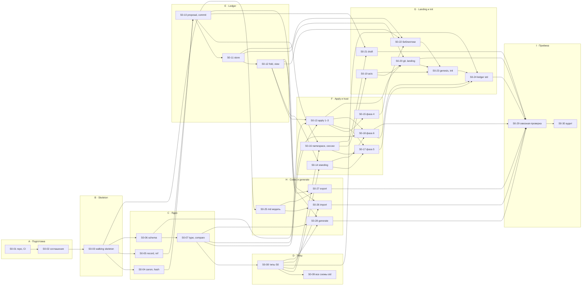

# S0 · Kernel and ledger — план фазы

Статус фазы — в [plan/STATUS.md](../../STATUS.md), статусы задач — на [доске фазы](STATUS.md), правило → задача — в [RULES.md](RULES.md).

## 1. Цель

S0 доказывает ядро и ledger (SL-Z02): kernel (02), types (03), references (04); ledger (05) — proposals, apply, fold и read views, landing с портом `git` и `local` acts, codec; trust (06) — namespace и pins, сессии и сертификаты, подписанные собственным ключом человека или машины, standing; тип `setup` как данные; stores `memory` и `jsonl`, evidence как непрозрачные байты; подписи коммитов.

**Готово, когда** (SL-Z02, SL-01):

1. `docs/design` → blocks → `md` побайтно равен исходнику в CI;
2. rebuild каждого store (`memory`, `jsonl`) равен его строкам (LG-37);
3. проверка зелёная в CI, и владелец принимает фазу командой приёмки (Q-07).

Первый корпус — сам дизайн LATTICE на английском (SL-02). До переключения версия ядра `0`, все stores одноразовые и пересобираются из `docs/design` (SL-04).

## 2. Объём

**В объёме — 191 правило** по таблице SL-Z04: README, 00, 01, 02, 13, 14, 03, 04, 05 и 06 за вычетом исключений, плюс части RT-10 (тип `setup`) и RT-32 (команды `init`, `draft`, `land`, `verify-store`, `export`, `migrate`, `session`). Полный список с задачами — [RULES.md](RULES.md), его генерирует `plan-check`.

**Частично в S0** — правила, часть которых SL-Z04 относит к позднему срезу (D205). Что делается в S0 простыми словами; источник правды — SL-Z04:

| Правило | В S0 | Позже |
|---|---|---|
| LG-02, LG-03 | порт `store` и его контракт-сюита для `knowledge`: `append`, `commits`, `tail`, строки, `evidence(hash)` | `runtime`: `seq` и время append, отказ по сроку сертификата, `content(hash)` — S1 |
| LG-16 | фазы 1–6; фаза 7 отклоняет с LG-21 всё, что требует допуска (Q-05) | LG-21 — S1 |
| LG-22 | landing без записи `docs/` | `docs/` из нового tail — SW (LG-43) |
| LG-28 | локальный landing владельцем, `forge: none` | landing в CI по act; запись step — S1 |
| LG-38 | все вопросы, кроме `tuple`; `evidence` — непрозрачные байты | `tuple` — S1 (DP-21) |
| LG-51 | (1) dry-run на tail `main` с `local` acts; (3) fitness-тесты | (2), (4) — SW; (5) — S3 |
| TR-10 | ключи `human` и `machine`, свои ключи | ключи, которыми caller выдаёт роли — S3 |
| TR-11 | сертификат, подписанный своим ключом; срок по времени act или `at` commit | срок по времени store для `runtime` — S1 |
| TR-12 | цепочка ключ policy → сертификат → proposal | сессии агентов с сертификатом caller — S3 |
| TR-14 | adapters `local`, `init`, `fixture`, `recorded` | `github`, `gitlab` — S1 |
| TR-20 | строки таблицы без runs и делегирования | строки run-derived — S1, делегирования — S3 |
| TR-42 | `match` по типам, status facts, `policy`, `upgrade`, `namespace` | `match` по операции порта — S1 |

**Вне объёма** (SL-01 — срез не начинает механизм, который доказывает поздний): runtime, recording, модули `evidence`, `measure`, `runtime`, `capabilities`; `postgres` и `sync`; декодирование evidence; findings и signals; gate, `live`, live closure guard; `import-md`, `upgrade`, `rebind`, `cite`, `report`, `act`, `trace`; trailers OB-07 в обычных коммитах и commit hook; `docs/` как экспорт; всё из 15.

## 3. Как ведём фазу

Порядок выполнения одной задачи — навык [plan-task](../../../.claude/skills/plan-task/SKILL.md); здесь — какие правила дизайна он воплощает.

| Правило | Что значит для работы |
|---|---|
| SL-05 | сначала walking skeleton (S0-03) — одна тонкая change unit через все швы; после него — параллельные задачи, **одна на контракт, не на слой** |
| SL-06 | не больше трёх открытых PR задач одновременно (draft и ready вместе), пока узкое место — acts владельца |
| PR-15…PR-18 | одна задача — одна change unit — один PR; две задачи не меняют один контракт одновременно; конфликт — обычный шаг интеграции |
| ST-17 | каждая жёсткая проверка называет rule ID; на каждый такой ID — фикстура, которая её срабатывает, и та, что проходит |
| ST-04 | вне `adapters`, `assembly`, `cli` код чистый: без часов, случайности, окружения, сети и файлов |
| RM-08, PR-03 | в каждом PR — проверка замыкания по [closure-check](../../closure-check.md): от кода к реестру механизмов; итог — раздел «Замыкание» в описании PR |
| ST-15 | триггеры аудита: правка файла, которым владеет skeleton; новый модуль или порт; задача на ≥3 модуля (их печатает `plan-check`) |
| SL-08 | вопросы о дизайне, возникшие в реальной работе, сразу пишутся в [bench/questions.md](../../bench/questions.md) |

## 4. Этапы и задачи

| Этап | Задачи | Результат |
|---|---|---|
| A · Подготовка | [S0-01](tasks/S0-01-repo-toolchain-ci.md) репозиторий и CI · [S0-02](tasks/S0-02-code-conventions.md) соглашения кода | пустой репозиторий с зелёным CI на ubuntu и windows; правила записи данных, отказов и фикстур |
| B · Skeleton | [S0-03](tasks/S0-03-walking-skeleton.md) walking skeleton | все папки модулей S0, полная матрица ST-01 в тесте структуры, интерфейсы портов, таблица команд, сквозной путь `land --dry-run` → `land` → `append` → вопрос view |
| C · Ядро | [S0-04](tasks/S0-04-canon-hash.md) canon и hash · [S0-05](tasks/S0-05-record-ref.md) record и ref · [S0-06](tasks/S0-06-schema-validate.md) schema · [S0-07](tasks/S0-07-type-compare.md) type и `compare` | чистое ядро с замороженными векторами |
| D · Типы как данные | [S0-08](tasks/S0-08-std-types-s0.md) типы S0 · [S0-09](tasks/S0-09-std-schemas-drafts.md) черновики всех схем `std` | исходники `core` и `std`; отчёт о достаточности подмножества схем до заморозки ядра |
| E · Ledger | [S0-10](tasks/S0-10-proposal-commit.md) proposal и commit · [S0-11](tasks/S0-11-store-port.md) порт `store` · [S0-12](tasks/S0-12-fold-view.md) fold и read view | цепочка коммитов, stores `memory` и `jsonl`, проекции, `verify-store` |
| F · Apply и trust | [S0-13](tasks/S0-13-apply-core.md) apply, фазы 1–3 · [S0-14](tasks/S0-14-standing.md) standing · [S0-15](tasks/S0-15-phase4-references.md) фаза 4 · [S0-16](tasks/S0-16-namespace-sessions.md) namespace и сессии · [S0-17](tasks/S0-17-phase5-authority.md) фаза 5 · [S0-18](tasks/S0-18-phase6-evolution.md) фаза 6 | apply со всеми фазами S0; standing; `session`, `migrate` |
| G · Landing, init, библиотеки | [S0-19](tasks/S0-19-acts-port.md) порт `acts` · [S0-20](tasks/S0-20-git-landing.md) `git` и landing · [S0-21](tasks/S0-21-draft-command.md) `draft` · [S0-22](tasks/S0-22-libraries-visible-set.md) библиотеки · [S0-23](tasks/S0-23-genesis-init.md) genesis и `init` · [S0-24](tasks/S0-24-std-ledger.md) ledger `std` | `init` → `draft` → `land` в git-репозитории; `std` как библиотека с постоянным hash |
| H · Codec и generate | [S0-25](tasks/S0-25-codec-md-model.md) модель `md` · [S0-26](tasks/S0-26-codec-import.md) import · [S0-27](tasks/S0-27-codec-export.md) export · [S0-28](tasks/S0-28-generate.md) generate | побайтный round-trip `docs/design`; TS-типы и конфиг линтера из типов |
| I · Приёмка | [S0-29](tasks/S0-29-e2e-acceptance.md) сквозная проверка и CI · [S0-30](tasks/S0-30-architecture-audit.md) архитектурный аудит · [S0-31](tasks/S0-31-bench-questions.md) вопросы для bench (сквозная) | зелёная проверка S0, команда приёмки, аудит с ratchet |

## 5. Граф зависимостей



S0-31 (вопросы для bench) идёт параллельно всей фазе и ни от чего не зависит.

**Дорожки после skeleton.** Три независимые линии укладываются в лимит SL-06: **ядро** (S0-04…S0-08), **codec** (S0-25 — можно начинать сразу после skeleton, он снимает главный риск R1), **ledger** (S0-10…S0-12, как только готовы S0-04 и S0-05). Дальше линия trust (S0-16, S0-19) идёт параллельно apply (S0-13…S0-18).

**Критический путь** печатает `plan-check` (вес S = 1, M = 2, L = 3). По построению он проходит через skeleton → canon → commit → store → fold → apply → landing → init → `std` → приёмка; ускорять фазу имеет смысл только на нём.

## 6. Структура репозитория к концу S0

```text
lattice/
├── .gitattributes          * text=auto eol=lf — без этого round-trip ломается на Windows (D-10)
├── .gitignore              node_modules/ dist/ gen/ .lattice/ .obsidian/
├── package.json            один пакет `lattice`, ESM, bin `lattice`
├── tsconfig.json  eslint.config.js  vitest.config.ts
├── AGENTS.md  CLAUDE.md    правила для агентов-исполнителей; CLAUDE.md — только `@AGENTS.md`
├── .claude/skills/plan-task/  порядок выполнения задачи плана (`/plan-task S0-NN`)
├── CONVENTIONS.md          соглашения кода (S0-02)
├── docs/design/            источник до SW (RM-06), экспорт после (LG-43)
├── discussion/             журнал решений; не корпус
├── plan/                   этот план; не корпус
├── std/                    библиотека `std` (TY-01): исходники типов и собранный ledger (Q-03, Q-04)
│   ├── source/             тела типов как JSON — исходник до переключения
│   └── knowledge.jsonl     собранный ledger; его hash — константа версии (LG-48)
├── scripts/                dev-скрипты: сборка `std`, пересборка store из `docs/design` (Q-07)
├── src/
│   ├── kernel/             Record, Canon, Type, Schema, Ref — чистое, без импортов (KR-01, KR-02)
│   ├── trust/              namespace policy, подписи, сертификаты, basis, in force, standing
│   ├── ledger/             commits, apply и фазы, fold, read view, landing, библиотеки, init;
│   │   └── ports/          интерфейсы `store`, `acts`, `git`, `clock`, `ids` (LG-23)
│   ├── codec/              `md` import и export (LG-42)
│   ├── generate/           TS-типы и валидаторы, конфиг линтера (ST-08, ST-09)
│   ├── adapters/           по папке на адаптер; только их импортирует `assembly` (ST-06)
│   │   ├── store-memory/  store-jsonl/
│   │   ├── git-repo/  git-fixture/
│   │   ├── acts-local/  acts-init/  acts-fixture/  acts-recorded/
│   │   └── clock-system/  clock-fixed/  ids-ulid/  ids-counter/
│   ├── assembly/           сборка из конфигурации, чтение `store/lattice.json`
│   └── cli/                команды RT-32 части S0
├── test/
│   ├── structure/          матрица ST-01, ST-04…ST-06, список файлов ядра (ST-05)
│   ├── vectors/            замороженные векторы KR-13: rfc8785/, nfc/, formats/
│   ├── fixtures/<RULE-ID>/ trigger/ и pass/ на каждый rule ID жёсткой проверки (ST-17)
│   ├── contract/           контракт-тесты портов на всех адаптерах (ST-07, LG-03, LG-29)
│   ├── keys/               dev-ключи ядра `0`, публично и небезопасно (Q-04)
│   └── e2e/                round-trip `docs/design`, rebuild stores, `init` → `land`
├── gen/                    генерируется по требованию, в git не хранится (ST-08)
└── .lattice/               локальное состояние: сессии, кеш fold библиотек (LG-45, LG-50)
```

Модули `evidence`, `measure`, `runtime`, `capabilities` в S0 папок не получают: SL-05 создаёт папки модулей своего среза, но матрица ST-01 в тесте структуры — полная, с ними.

`store/` самого репозитория LATTICE в S0 не появляется: genesis пишется под ядром `1` на переключении (SL-03). Все stores S0 живут во временных каталогах тестов и dev-скриптов.

## 7. Порты и адаптеры S0

| Порт | Интерфейс | Адаптеры S0 | Позже |
|---|---|---|---|
| `store` | LG-02, часть `knowledge` | `memory`, `jsonl` | `postgres`, часть `runtime` — S1 |
| `git` | LG-23: `tail`, `prepare`, `push` | `repo`, `fixture` | — |
| `acts` | TR-14, TR-16 | `local`, `init`, `fixture`, `recorded` | `github`, `gitlab` |
| `clock` | LG-23 | `clock-system`, `clock-fixed` (ST-07) | — |
| `ids` | LG-23 | `ids-ulid`, `ids-counter` (ST-07) | — |

У портов ledger нет класса операций, и они не записываются (LG-23). Новый порт или адаптер сверх таблицы — только с правилом, которое его требует (ST-02).

## 8. Тесты и CI

| Вид | Где | Что гарантирует |
|---|---|---|
| замороженные векторы | `test/vectors/`, hash файлов закреплён в тесте | canon и hash не меняются без смены версии ядра (KR-13) |
| фикстуры правил | `test/fixtures/<RULE-ID>/` | каждая жёсткая проверка срабатывает и пропускает (ST-17, LG-17) |
| контракт-тесты портов | `test/contract/` | все адаптеры порта ведут себя побайтно одинаково (ST-07, LG-03, LG-29) |
| свойства (fast-check) | рядом с модулями | rebuild = накопленные строки (LG-37); `after` apply = `view(seq)` store (LG-39); корректность `compare`; `parse∘print` кодека |
| эталон | `test/e2e/` | весь `docs/design` проходит round-trip с первой задачи кодека |
| структура | `test/structure/` | направление импортов, чистота, периметр ядра (ST-04…ST-06) |

Задания CI к концу S0: `lint-ids` и `plan-check`; type check (после генерации `gen/`); ESLint по профилю качества; unit и property-тесты; тест структуры; покрытие фикстурами; round-trip `docs/design`; rebuild stores. Матрица — ubuntu и windows. Ночное задание — rebuild всех stores с нуля (LG-37). CI не держит своей логики — только команды LATTICE и тесты (LG-51).

## 9. Что S0 готовит для переключения

| Условие SL-03 | Вклад S0 | Остаток на SW |
|---|---|---|
| (1) round-trip `docs/design` зелёный в CI | S0-25…S0-27, S0-29 — полностью | — |
| (2) подмножество схем покрывает каждый тип `std`, схемы набросаны, ядро замораживается как `1` | S0-08 — типы S0; S0-09 — черновики остальных и отчёт о пробелах подмножества | досказать схемы, заморозить ядро `1` |
| (3) upgrade `std@1 → @2` проходит в тесте | S0-22, S0-24 — библиотеки, pins, постоянный hash | LG-46, `upgrade` |
| (4) CI проверяет change requests по LG-51 (1)–(4) с `local` acts | S0-29 — условия (1) и (3) | условия (2) и (4) |
| (5) `draft` существует | S0-21 — полностью | — |
| (6) одна реальная правка дизайна приземлилась через proposal из ветки | — | всё |

## 10. Риски

| ID | Риск | Признак | Мера |
|---|---|---|---|
| R1 | побайтный round-trip ломается на мелочах: окончания строк, `\|` в ячейках, `…` в диапазонах, NFC, финальный перевод строки | расхождение байтов в CI на windows | D-10; свой канонический принтер (D-05); эталонный тест на всём `docs/design` с первой задачи кодека; codec — ранняя дорожка |
| R2 | `compare` (KR-22) сложен, и его правила неполны для сочетаний ключевых слов | спорные случаи в ревью | по умолчанию `incomparable`, когда узость нельзя показать структурно; property-тест корректности: если `narrower`, то каждое значение A проходит B |
| R3 | циклы bootstrap: `std` → namespace → тип namespace → genesis | apply отклоняет commit 2 у `std` | Q-03 до S0-23; фикстурная библиотека в тестах S0-22 |
| R4 | подмножество схем не хватает какому-то типу `std` уже после заморозки ядра | черновик требует ключевого слова вне KR-18 | S0-09 в S0, а не на SW: пробел виден, пока ядро `0` |
| R5 | ключи и подписи на Windows: ssh-agent, формат OpenSSH, git SSH signing | `local` act не проверяется в CI windows | Q-04: dev-ключи из файлов для ядра `0`; свой разбор OpenSSH; CI на windows |
| R6 | недетерминизм fold: порядок обхода `Map`, сортировка, неканонические строки | rebuild ≠ накопленным строкам | строки — канонический JSON; ключи строк сортируются; property-тест LG-37 с первой версии fold |
| R7 | расползание объёма из поздних срезов | задача тянет runtime, evidence, findings | раздел 2 «вне объёма»; `plan-check` предупреждает о правилах чужой фазы в `rules` |
| R8 | acts владельца — узкое место | копятся PR в статусе ready | SL-06: не больше трёх открытых PR задач, ready считаются вместе с draft; ревью пакетами |
| R9 | файлы skeleton постоянно правятся — каждый раз триггер аудита | частые ST-15 | skeleton владеет минимумом: интерфейсы портов, таблица команд, тест структуры, точки входа модулей |
| R10 | в реализации появляется новый механизм или обход — второй путь записи, кеш, флаг отключения проверки, — и следующие задачи строятся на нём | в PR нет раздела «Замыкание», скрипт или тест-хелпер пишет мимо landing | [closure-check](../../closure-check.md) в каждом PR, на триггерах ST-15 и в S0-30; проверяемые находки — fitness-тесты (ST-16) |

## 11. Вопросы к владельцу

Q-01…Q-08 закрыты 2026-10-06: приняты рекомендации. Q-09…Q-12 — решения владельца по ревью S0-03, Q-13…Q-16 — по его второй волне, Q-17…Q-19 — по третьей, Q-20…Q-22 — по четвёртой, Q-23…Q-26 — по пятой. Ответ на новый вопрос записывается в колонку «Решение». Задача, которая ссылается на вопрос без решения, получает метку `blocked` на своём PR, когда доходит до этого места.

| ID | Вопрос | Рекомендация | Блокирует | Решение |
|---|---|---|---|---|
| Q-01 | Где живёт репозиторий и CI: GitHub, GitLab или только локально? | GitHub + Actions как исполнитель CI; landing в S0 — `forge: none` и `local` acts, это и доказывает S0; adapters `github`/`gitlab` — вместе с `forge` | S0-01 | принята рекомендация, 2026-10-06 |
| Q-02 | Как формируются id секций и документов? RM-Z03 даёт id только блокам с ID правила. | документ — секция уровня 1 с id `lattice/<имя файла>` (`lattice/02-kernel`, `lattice/readme`); подсекция — `<id документа>.<slug заголовка>` (`lattice/02-kernel.canon`). Переименование заголовка — новый id; после SW — по RF-12. Нужна строка в RM-Z03 | S0-26 | принята; RM-Z03 дополнен (D203) |
| Q-03 | Как строится ledger `std`? Тип `std/namespace` живёт в самом `std`: namespace и его тип приходят в commit 2 вместе, policy в `before` ещё нет (TR-06), а LG-18 исключает только «namespace, записанный в namespace, который он создаёт». | добавить в LG-18 исключение: при init ledger'а библиотеки типы её namespace пишутся в commit 2 вместе с namespace, с acts adapter `init`; остальные типы `std` — обычный proposal с act владельца. Это правка дизайна | S0-23, S0-24 | принята; LG-18 и LG-47 дополнены (D204) |
| Q-04 | Чем подписываются сессии, `local` acts и ledger `std` до переключения? | ядро `0`: dev-ключи в `test/keys/` (публичные, помечены небезопасными) подписывают `std` и тестовые stores, сборка `std` детерминирована и проверяется в CI; человек подписывает сертификат сырой Ed25519-подписью ключом из незашифрованного OpenSSH-файла (путь — в `.lattice/`); `local` act — SSH-подписанный коммит или тег, проверка через `git verify-commit` с allowed signers из policy; GPG — по требованию. Настоящий ключ владельца — с SW | S0-16, S0-19, S0-24 | принята рекомендация, 2026-10-06 |
| Q-05 | Что делает фаза 7 apply в S0? LG-16 её включает, LG-21 — S1, evidence не декодируется. | фаза 7 отклоняет с правилом LG-21 любой intent, требующий допуска (`live`, `calibration`, `report`) или ссылающийся на run; остальное проходит. Так `live` нельзя получить в обход gate | S0-13 | принята рекомендация, 2026-10-06 |
| Q-06 | Как оформить правила документов S0, чей механизм — в поздних срезах (таблица «частично в S0», раздел 2)? | принять таблицу раздела 2 как рабочую; при ближайшей правке дизайна дописать её в исключения SL-Z04 | — | принята; SL-Z04 дополнена (D205) |
| Q-07 | Какой командой владелец принимает S0 (SL-01)? `import-md` — команда SW, а S0 пересобирает store из `docs/design` (SL-04). | dev-скрипт `scripts/rebuild-from-design` (codec import → proposal → `land` с dev-ключом) собирает store; приёмка — `npm run accept:s0`: пересборка, `lattice export` и побайтное сравнение с `docs/design`, `lattice verify-store` для `memory` и `jsonl` | S0-29 | принята рекомендация, 2026-10-06 |
| Q-08 | Откуда профиль качества до переключения (ST-09)? Профиль — блок в policy, а ledger `lattice` до SW одноразовый. | в S0 конфиг ESLint пишется руками в S0-01 (сложность 10, функция 50 строк, вложенность 3, параметры 4, файл 300 строк); генератор S0-28 проверяется на фикстурном профиле; на сгенерированный конфиг — на SW | — | принята рекомендация, 2026-10-06 |
| Q-09 | Ревью S0-03: landing писал коммит в store `memory` после `push`, и знание не попадало в git (LG-22, LG-23, LG-27) | тонкий `jsonl` на worktree | S0-03 | 2026-10-06: тонкий `jsonl` — одна каноническая строка на коммит, чтение с начала при открытии; landing: worktree → `append` через `jsonl` → удалить proposal → `push`; worktree `git-fixture` — временный каталог, `push` фиксирует его содержимое; адаптер canon не знает — ledger отдаёт готовые строки. Проверки цепочки, обрезанной строки и evidence — S0-11; CAS, dry-run, trailers и `git-repo` — S0-20 |
| Q-10 | Ревью S0-03: тонкие места бросали исключения вместо отказов (KR-10, LG-09, LG-54) | отказы с rule ID сейчас | S0-03 | 2026-10-06: отказы с rule ID и фикстурами trigger/pass — KR-10 (не JSON, не UTF-8), LG-09 (форма proposal поверхностно; полная — S0-10), LG-54 (ровно один proposal; полный landing — S0-20); мягкий разбор — G-16 |
| Q-11 | Ревью S0-03: `push` принимает один объект, LG-23 пишет `push(worktree, ref, expected, message, trailers)` | объект | S0-03 | 2026-10-06: объект, правило — в `CONVENTIONS.md` §1, не в D-11: операция порта с несколькими аргументами принимает один объект с именами аргументов из правила, у всех портов, без порога |
| Q-12 | Ревью S0-03: `request` остаётся `null`, G-14 без решения | принять G-14 | S0-03 | 2026-10-06: G-14 принята; формулировка G-14 и риски S0-13 дополнены |
| Q-13 | Ревью S0-03, волна 2: bin передаёт `assembled: null`, сквозной путь SL-05 пройден через `run()` с тестовой сборкой, а тестовые адаптеры жили в единственной сборке `src/assembly` | принять до S0-23 | S0-03 | 2026-10-06: принята рекомендация. «Команда» SL-05 показана через `run()` — функцию, которую зовёт bin, — со сборкой `test/support/assembly.ts`. `src/assembly` соединяет порты и сама открывает store `jsonl` (LG-23); адаптеры для тестов — `*-fixture`, `clock-fixed`, `ids-counter` — не импортирует ни один файл `src/` (тест структуры, ST-07). Bin получает рабочую сборку из `store/lattice.json` в S0-23, когда есть рабочие адаптеры S0-19 и S0-20; до тех пор `lattice land` из bin кончается кодом 2 «no store» (`test/cli/bin.test.ts`) |
| Q-14 | Ревью S0-03, волна 2: тест структуры пускал к порту `judge` кроме `decide` адаптеры `judge-*` и `assembly` (DP-14, ST-04) | `decide` и адаптеры `judge-*` | S0-03 | 2026-10-06: принята рекомендация. Порт получает только `decide`; адаптер `judge-*` его реализует и импортирует интерфейс, как любой адаптер (ST-01); `assembly` передаёт адаптер в `decide`, не импортируя порт, и тест структуры отклоняет порт в `assembly` |
| Q-15 | Ревью S0-03, волна 2: тип записи `Record` (KR-04) затеняет утилиту TypeScript `Record<K, V>`, и `CONVENTIONS.md` §1 сменил запись словарей без решения | принять `Record` | S0-03 | 2026-10-06: принята рекомендация. Тип записи — `Record`, термин глоссария (KR-04, ST-03); словарь — индексная сигнатура `{ readonly [key: string]: V }`, утилита `Record<K, V>` в коде не используется |
| Q-16 | Ревью S0-03, волна 2: `lattice land` с change request, которого нет, кончался исключением `bug:` в `git-fixture` — на вход пользователя (`CONVENTIONS.md` §2) | отказ LG-54 | S0-03 | 2026-10-06: принята рекомендация. Порт `git`: `tail(ref)` — `null`, когда ref нет; landing сначала разрешает change request и несуществующий отклоняет LG-54 с путём `""` и `got: null` (`changeRequest`, фикстура `test/fixtures/LG-54/trigger/no-change-request.json`). Отсутствие `main` остаётся `bug:`: его создаёт init (S0-23) |
| Q-17 | Ревью S0-03, волна 3: `CONVENTIONS.md` §2 «чистые модули синхронны, `Promise` только на порту» дополнен оговоркой про landing без решения | принять оговорку | S0-03 | 2026-10-06: принята рекомендация. Функция, которая ждёт порт (landing, открытие store), асинхронна; проверки, apply, fold и всё, что она зовёт между портами, синхронны. Иначе нельзя: landing чист по ST-04 и достаёт git, acts, store, время и id только через порты LG-23 |
| Q-18 | Ревью S0-03, волна 3: `store-jsonl` и `store-memory` сортируют строки своим `byKey`, а не `sortRows` (closure «порядок»); адаптер по ST-01 импортирует только свой порт | компаратор из порта | S0-03 | 2026-10-06: принята рекомендация. Порядок ключей — часть контракта порта `store`: `src/ledger/ports/store.ts` отдаёт `sortRows`, одну функцию для ledger и всех адаптеров |
| Q-19 | Ревью S0-03, волна 3: LG-23 сверял строки, которые `store-jsonl` прочёл как `utf8` и отфильтровал: снятый `\n`, пустая строка и байты не UTF-8 проходили, а `append` склеивал строку с tail (LG-23, KR-10) | байты через git | S0-03 | 2026-10-06: принята рекомендация. LG-23 сравнивает байты файла `store/knowledge.jsonl` в worktree tail `main` и change request (`Worktree.read`); landing называет путь LG-50, как и `store/proposals/`; `expected` и `got` отказа — hash `sha256:…` байтов. Порт `store` отдаёт строки байтами: `store-jsonl` режет файл по `\n`, ничего не декодирует и не выбрасывает, ledger декодирует UTF-8 с отказом KR-10. Обрезанная последняя строка — S0-11 (Q-09). Кандидат ratchet «путь `store/knowledge.jsonl` только в `store-jsonl`» стал «пишет его только `store-jsonl`» |
| Q-20 | Ревью S0-03, волна 4: набросок S0-03 говорил «`acts-fixture` всегда approve», а код отдаёт acts из тестовых данных по change request и без них — `[]`; заметка в S0-19 ссылалась на Q-13, который этого не решает | acts из данных | S0-03, S0-19 | 2026-10-06: принята рекомендация. `acts-fixture` отдаёт acts, которые тест дал ему по change request; change request без них не имеет acts. Разрешающего умолчания нет: act засчитывается только через порт (TR-14…TR-17, `plan/closure-check.md`, класс «acts и права») |
| Q-21 | Ревью S0-03, волна 4: PR-13 и LG-44 закрепляют код другого проекта «by name, version and hash», а тест структуры проверял только точную версию; hash оставлен на `package-lock.json` без решения | тест на integrity | S0-03 | 2026-10-06: принята рекомендация. Hash пакета npm — `integrity` sha512 его tarball в `package-lock.json`, который проверяет `npm ci`. Тест структуры отклоняет импорт пакета, у которого в `package-lock.json` нет записи с той же точной версией, что в `package.json`, и с `integrity` sha512 (`test/structure/audit-imports.ts`, `boundaries.test.ts`). Пины библиотек LATTICE в теле namespace проекта (LG-44) — S0-23 и S0-24 |
| Q-22 | Ревью S0-03, волна 4: `CONVENTIONS.md` §1 сменил `createX(deps)` на `createX(options)`, §3 — `reject(rule, at)` на `reject(rule, place)` без решения | принять правки | S0-03 | 2026-10-06: принята рекомендация. Адаптер получает настройки (`dir`, `branches`, `at`), а не зависимости, — фабрика `createX(options)`. Второй аргумент `reject` — место отказа (`intent`, `path`, `expected`, `got`), и называется `place`: `at` в LATTICE — время записи и коммита (KR-04, LG-06) |
| Q-23 | Ревью S0-03, волна 5: «Не обход» в `plan/closure-check.md` разрешал только сырые коммиты LG-36, а trigger-фикстуры ST-17 кладут сырые байты store и дерево git, которых никакой landing не пишет: `{}\n` на `main` (LG-06), каталог на месте `store/knowledge.jsonl` (LG-23), сырые строки store в `test/fixtures/` | разрешить входы trigger | S0-03 | 2026-10-06: принята рекомендация. В «Не обход» дописано: сырые входы trigger жёстких проверок (ST-17) — байты store, дерево git, строки, которых не пишет landing, — только в `test/` и с пометкой. Pass-случаи строят store только через `land` или `apply` |

## 12. Мелкие пробелы дизайна

Решаются внутри задачи по рекомендации; если владелец не согласен — правка дизайна. Найденный по ходу пробел дописывается сюда со следующим номером.

| ID | Пробел | Рекомендация | Задача |
|---|---|---|---|
| G-01 | поля `refs`, `table`, `list` (LG-42) не перечислены в телах TY-Z03, а объекты закрыты (KR-18) | `refs` — на базовом `knowledge`; `table` и `list` — на `clause`, `prose`, `example` | S0-08 |
| G-02 | базовые типы TY-Z02 — abstract или нет? | abstract (KR-16): записи только у подтипов | S0-08 |
| G-03 | канонический порядок записей коммита «entity id, fact key, event id» (LG-06) | три группы по очереди: сущности по `id`, факты по каноническому JSON ключа, прочие события по `id` | S0-10 |
| G-04 | идемпотентность по hash proposal (LG-12, LG-25) требует поиска commit по hash proposal, а закрытый список вопросов read view (LG-38) его не содержит | ищет landing через store до apply; apply остаётся над `before` | S0-13, S0-20 |
| G-05 | по каким байтам считается лимит тела 256 KiB (KR-13) | канонические UTF-8 байты `body` | S0-04 |
| G-06 | «абсолютный URI» (KR-24): в RFC 3986 `absolute-URI` без фрагмента | схема обязательна, фрагмент допустим (`URI` RFC 3986) | S0-05 |
| G-07 | ULID (KR-11): проверять ли переполнение 128 бит | да: первый символ не больше `7`, как в спецификации ULID | S0-04 |
| G-08 | имя файла proposal в `store/proposals/` (LG-50) | `<slug ветки>.json`, один на change request (LG-54) | S0-21 |
| G-09 | заголовок сгенерированных файлов (OB-10) ломает побайтное равенство с ручными `docs/` до SW | заголовок появляется на SW вместе с LG-43; import его снимает | S0-27 |
| G-10 | запись подписей и ключей в записях | подпись — `ed25519:<base64url без =>`; публичный ключ — строка OpenSSH `ssh-ed25519 AAAA…` | S0-10 |
| G-11 | где проверяется «aliases form a star, never a chain» (TR-29) | фаза 4, правило TR-29 | S0-15 |
| G-12 | грамматика `n` в `id@n` | целое ≥ 1 без ведущих нулей | S0-05 |
| G-13 | формат `path` и значение `intent` в отказе (LG-17) и `path` в нарушении (KR-21) не заданы | `path` — JSON Pointer (RFC 6901); `intent` — `id`, записанный в intent, как есть, и тогда `path` — внутри этого intent; без строкового `id` или вне intent — `null` и `path` от корня входа. Так отказы не зависят от порядка intents (LG-11) | S0-02 |
| G-14 | кто заполняет `prev` и `request` заголовка коммита (LG-06): apply (LG-14) получает `before`, proposal, acts и evidence, но ни hash tail, ни `uri` change request; закрытый список вопросов read view (LG-38) hash tail не содержит | **принята владельцем 2026-10-06** (ревью S0-03): apply оставляет `prev`, `request` и `sig` — `null`; landing дописывает `prev` — hash tail-коммита store — и `request` — `uri` change request или `null` до S0-20; `sig` — S0-10, S0-20. На проекции эти поля не влияют, поэтому `after` apply остаётся тем, что покажет store (LG-15). Фазе 3 (`at` не убывает, LG-06) нужен `at` tail-коммита из `before`; кандидат на правку LG-38 — tail-заголовок (`seq`, hash, `at`) в read view, тогда `prev` переходит в apply | S0-03, S0-13, S0-20 |
| G-15 | ST-06 «only `assembly` and `cli` import `codec` and `generate`» и ST-01 «`cli` may import `assembly`» расходятся для `cli` | строгое чтение: ST-06 — ограничение, ST-01 — разрешение; `cli` импортирует только `assembly`, а `export` идёт `cli` → `assembly` → `codec`. Тест структуры проверяет обе строки; формулировку ST-06 уточнить при ближайшей правке дизайна | S0-03 |
| G-16 | до строгого парсера (D-04) разбор JSON мягкий: `JSON.parse` берёт дубликаты ключей, целые вне ±2^53, строки не в NFC, `-0` — то, что KR-10 отклоняет | **решение владельца 2026-10-06** (ревью S0-03): мягкий разбор живёт в одной функции — `parseJson` в `src/kernel/parse.ts`; она уже отказывает с KR-10 на тексте не JSON и байтах не UTF-8, а S0-04 заменяет её строгим парсером. До тех пор это известное ограничение, а не обход (`plan/closure-check.md`) | S0-03, S0-04 |

## 13. Решения по умолчанию

Действуют, пока владелец не решил иначе.

| ID | Решение | Почему |
|---|---|---|
| D-01 | Node 22, TypeScript `strict` + `noUncheckedIndexedAccess` + `exactOptionalPropertyTypes`, ESM; один пакет `lattice`, модули — папки `src/<module>` | D1; модули ST-01 — границы импорта, не пакеты; `lattice-caller` — отдельный пакет с S1 |
| D-02 | npm | меньше инструментов |
| D-03 | vitest; property-тесты — fast-check | TS без сборки; свойства LG-37, LG-39, KR-22 естественно формулируются генераторами |
| D-04 | свой строгий JSON-парсер в `kernel` | `JSON.parse` молча теряет дубликаты ключей, а KR-10 требует отказа |
| D-05 | свой разбор и вывод `md` в `codec` | общие md-библиотеки принимают неканонический вход и не сохраняют байты (LG-42) |
| D-06 | sha256 и Ed25519 — `node:crypto`; ULID — малая библиотека только в `ids-ulid` | D31; ядро получает sha256 от платформы (KR-02) |
| D-07 | тест структуры — свой, на TypeScript compiler API; матрица ST-01 — данные | правила ST-04 точнее, чем общий инструмент; сообщения называют rule ID |
| D-08 | git — CLI `git` в `git-repo`; локальный CAS — `git update-ref <ref> <new> <expected>` | атомарный compare-and-swap без сервера (LG-23) |
| D-09 | CI на ubuntu и windows | владелец работает на Windows; ловим пути и окончания строк |
| D-10 | `.gitattributes`: `* text=auto eol=lf` | `core.autocrlf` на Windows ломает побайтный round-trip |

## 14. Готово, когда

- [ ] round-trip `docs/design` → blocks → `md` побайтно равен в CI на ubuntu и windows
- [ ] rebuild stores `memory` и `jsonl` равен накопленным строкам; ночное задание зелёное (LG-37)
- [ ] каждое правило S0 отнесено к задаче (`plan-check` без ошибок); у каждого rule ID жёсткой проверки есть фикстуры trigger и pass (ST-17)
- [ ] fitness-тесты зелёные: структура, type check, профиль качества, фикстуры (ST-12, часть S0)
- [ ] команды S0 работают: `init`, `draft`, `land`, `land --dry-run`, `verify-store`, `export`, `migrate`, `session`
- [ ] CI проверяет change request по LG-51 (1) и (3) с `local` acts на тестовом репозитории
- [ ] архитектурный аудит проведён, принятые находки превращены в fitness-тесты или правила (ST-14, ST-16)
- [x] вопросы Q-01…Q-08 закрыты или явно перенесены в SW
- [ ] владелец принял фазу командой приёмки; в [plan/STATUS.md](../../STATUS.md) S0 — ✅, журнал фаз дополнен
