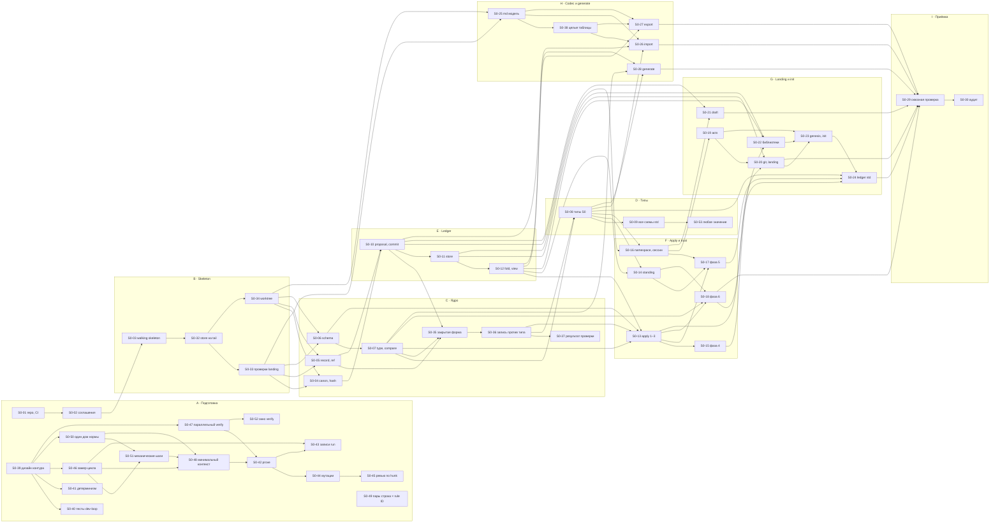

# S0 · Kernel and ledger — план фазы

Статус фазы — в [plan/STATUS.md](../../STATUS.md), статусы задач — на [доске фазы](STATUS.md), правило → задача — в [RULES.md](RULES.md).

## 1. Цель

S0 доказывает ядро и ledger (SL-Z02): kernel (02), types (03), references (04); ledger (05) — proposals, apply, fold и read views, landing с портом `git` и `local` acts, codec; trust (06) — namespace и pins, сессии и сертификаты, подписанные собственным ключом человека или машины, standing; тип `setup` как данные; stores `memory` и `jsonl`, evidence как непрозрачные байты; подписи коммитов.

**Готово, когда** (SL-Z02, SL-01):

1. `docs/design` → blocks → `md` побайтно равен исходнику в CI;
2. rebuild каждого store (`memory`, `jsonl`) равен его строкам (LG-37);
3. проверка зелёная в CI, и владелец принимает фазу командой приёмки (Q-07).

Первый корпус — сам дизайн LATTICE на английском (SL-02). До переключения версия ядра `0`, все stores одноразовые и пересобираются из `docs/design` (SL-04).

## 2. Объём

**В объёме — 191 правило** по таблице SL-Z04: README, 00, 01, 02, 13, 14, 03, 04, 05 и 06 за вычетом исключений, плюс части RT-10 (тип `setup`) и RT-32 (команды `init`, `draft`, `land`, `verify-store`, `export`, `migrate`, `session`). Полный список с задачами — [RULES.md](RULES.md), его генерирует `plan-check`.

**Частично в S0** — правила, часть которых SL-Z04 относит к позднему срезу (D205). Что делается в S0 простыми словами; источник правды — SL-Z04:

| Правило | В S0 | Позже |
|---|---|---|
| LG-02, LG-03 | порт `store` и его контракт-сюита для `knowledge`: `append`, `commits`, `tail`, строки, `evidence(hash)` | `runtime`: `seq` и время append, отказ по сроку сертификата, `content(hash)` — S1 |
| LG-16 | фазы 1–6; фаза 7 отклоняет с LG-21 всё, что требует допуска (Q-05) | LG-21 — S1 |
| LG-22 | landing без записи `docs/` | `docs/` из нового tail — SW (LG-43) |
| LG-28 | локальный landing владельцем, `forge: none` | landing в CI по act; запись step — S1 |
| LG-38 | все вопросы, кроме `tuple`; `evidence` — непрозрачные байты | `tuple` — S1 (DP-21) |
| LG-51 | (1) dry-run на tail `main` с `local` acts; (3) fitness-тесты | (2), (4) — SW; (5) — S3 |
| TR-10 | ключи `human` и `machine`, свои ключи | ключи, которыми caller выдаёт роли — S3 |
| TR-11 | сертификат, подписанный своим ключом; срок по времени act или `at` commit | срок по времени store для `runtime` — S1 |
| TR-12 | цепочка ключ policy → сертификат → proposal | сессии агентов с сертификатом caller — S3 |
| TR-14 | adapters `local`, `init`, `fixture`, `recorded` | `github`, `gitlab` — S1 |
| TR-20 | строки таблицы без runs и делегирования | строки run-derived — S1, делегирования — S3 |
| TR-42 | `match` по типам, status facts, `policy`, `upgrade`, `namespace` | `match` по операции порта — S1 |

**Вне объёма** (SL-01 — срез не начинает механизм, который доказывает поздний): runtime, recording, модули `evidence`, `measure`, `runtime`, `capabilities`; `postgres` и `sync`; декодирование evidence; findings и signals; gate, `live`, live closure guard; `import-md`, `upgrade`, `rebind`, `cite`, `report`, `act`, `trace`; trailers OB-07 в обычных коммитах и commit hook; `docs/` как экспорт; всё из 15.

## 3. Как ведём фазу

Порядок выполнения одной задачи — навык [plan-task](../../../.claude/skills/plan-task/SKILL.md); здесь — какие правила дизайна он воплощает.

| Правило | Что значит для работы |
|---|---|
| SL-05 | сначала walking skeleton (S0-03) — одна тонкая change unit через все швы; после него — параллельные задачи, **одна на контракт, не на слой** |
| SL-06 | не больше трёх открытых PR задач одновременно (draft и ready вместе), пока узкое место — acts владельца; задачи-инструменты S0-39…S0-48, S0-50 и S0-51 (раздел 8, «Контур проверки») в этот лимит не входят — решения владельца 2026-10-07 и 2026-10-08 |
| PR-15…PR-18 | одна задача — одна change unit — один PR; две задачи не меняют один контракт одновременно; конфликт — обычный шаг интеграции |
| ST-17 | каждая жёсткая проверка называет rule ID; на каждый такой ID — фикстура, которая её срабатывает, и та, что проходит |
| ST-04 | вне `adapters`, `assembly`, `cli` код чистый: без часов, случайности, окружения, сети и файлов |
| RM-08, PR-03 | в каждом PR — проверка замыкания по [closure-check](../../closure-check.md): от кода к реестру механизмов; итог — раздел «Замыкание» в описании PR |
| ST-15 | триггеры аудита: правка файла, которым владеет skeleton; новый модуль или порт; задача на ≥3 модуля (их печатает `plan-check`) |
| SL-08 | вопросы о дизайне, возникшие в реальной работе, сразу пишутся в [bench/questions.md](../../bench/questions.md) |

## 4. Этапы и задачи

| Этап | Задачи | Результат |
|---|---|---|
| A · Подготовка | [S0-01](tasks/S0-01-repo-toolchain-ci.md) репозиторий и CI · [S0-02](tasks/S0-02-code-conventions.md) соглашения кода · инструменты контура проверки (раздел 8): [S0-39](tasks/S0-39-proof-loop-design.md) правки дизайна · [S0-40](tasks/S0-40-tools-tests.md) тесты `dev-loop` · [S0-41](tasks/S0-41-deterministic-tests.md) детерминизм тестов · [S0-46](tasks/S0-46-loop-timing.md) замер цикла · [S0-47](tasks/S0-47-parallel-verify.md) параллельный verify · [S0-50](tasks/S0-50-conventions-one-home.md) один дом каждой нормы · [S0-51](tasks/S0-51-mechanical-steps.md) механические шаги в `dl` · [S0-48](tasks/S0-48-minimal-brief.md) минимальный контекст агентов · [S0-42](tasks/S0-42-verify-levels.md) `prove` · [S0-44](tasks/S0-44-mutate.md) мутации в `prove` · [S0-45](tasks/S0-45-review-evidence.md) ревью по hunk'ам · [S0-43](tasks/S0-43-dl-gate.md) записи run'ов · по разбору циклов `/dev-loop`: [S0-49](tasks/S0-49-fixture-pairs.md) фикстуры каждой пары «строка проверки × rule ID» · нестабильный тест: [S0-52](tasks/S0-52-verify-meet.md) окно шага-заглушки `verify` — `SAFEGUARD_MS` | пустой репозиторий с зелёным CI на ubuntu и windows; правила записи данных, отказов и фикстур; агент получает минимально достаточный контекст и доказывает изменённое один раз, полный прогон — только CI |
| B · Skeleton | [S0-03](tasks/S0-03-walking-skeleton.md) walking skeleton · по его архитектурному разбору: [S0-32](tasks/S0-32-open-tail.md) открытие store на tail `main` · [S0-33](tasks/S0-33-landing-checks.md) проверки landing до apply · [S0-34](tasks/S0-34-worktree-release.md) жизненный цикл worktree | все папки модулей S0, полная матрица ST-01 в тесте структуры, интерфейсы портов, таблица команд, сквозной путь `land --dry-run` → `land` → `append` → вопрос view; store на tail `main` — один модуль, один корень `path` отказов landing, worktree освобождается на каждом исходе |
| C · Ядро | [S0-04](tasks/S0-04-canon-hash.md) canon и hash · [S0-05](tasks/S0-05-record-ref.md) record и ref · [S0-06](tasks/S0-06-schema-validate.md) schema · [S0-07](tasks/S0-07-type-compare.md) type и `compare` · по архитектурному разбору волны 2: [S0-35](tasks/S0-35-closed-form.md) закрытая форма объекта · [S0-36](tasks/S0-36-record-against-type.md) запись против своего типа · [S0-37](tasks/S0-37-check-result.md) форма результата проверки | чистое ядро с замороженными векторами; закрытая форма — одна функция, фаза 2 одной записи — один вход, жёсткая проверка возвращает `Result` |
| D · Типы как данные | [S0-08](tasks/S0-08-std-types-s0.md) типы S0 · [S0-09](tasks/S0-09-std-schemas-drafts.md) черновики всех схем `std` · по его отчёту: [S0-53](tasks/S0-53-any-value-keyword.md) «любое значение» в KR-18 | исходники `core` и `std`; отчёт о достаточности подмножества схем до заморозки ядра |
| E · Ledger | [S0-10](tasks/S0-10-proposal-commit.md) proposal и commit · [S0-11](tasks/S0-11-store-port.md) порт `store` · [S0-12](tasks/S0-12-fold-view.md) fold и read view | цепочка коммитов, stores `memory` и `jsonl`, проекции, `verify-store` |
| F · Apply и trust | [S0-13](tasks/S0-13-apply-core.md) apply, фазы 1–3 · [S0-14](tasks/S0-14-standing.md) standing · [S0-15](tasks/S0-15-phase4-references.md) фаза 4 · [S0-16](tasks/S0-16-namespace-sessions.md) namespace и сессии · [S0-17](tasks/S0-17-phase5-authority.md) фаза 5 · [S0-18](tasks/S0-18-phase6-evolution.md) фаза 6 | apply со всеми фазами S0; standing; `session`, `migrate` |
| G · Landing, init, библиотеки | [S0-19](tasks/S0-19-acts-port.md) порт `acts` · [S0-20](tasks/S0-20-git-landing.md) `git` и landing · [S0-21](tasks/S0-21-draft-command.md) `draft` · [S0-22](tasks/S0-22-libraries-visible-set.md) библиотеки · [S0-23](tasks/S0-23-genesis-init.md) genesis и `init` · [S0-24](tasks/S0-24-std-ledger.md) ledger `std` | `init` → `draft` → `land` в git-репозитории; `std` как библиотека с постоянным hash |
| H · Codec и generate | [S0-25](tasks/S0-25-codec-md-model.md) модель `md` · [S0-26](tasks/S0-26-codec-import.md) import · [S0-27](tasks/S0-27-codec-export.md) export · [S0-28](tasks/S0-28-generate.md) generate · по архитектурному разбору волны 2: [S0-38](tasks/S0-38-md-model-tables.md) модель `md` с целыми таблицами | побайтный round-trip `docs/design`; документ, который не печатается обратно, не строится; TS-типы и конфиг линтера из типов |
| I · Приёмка | [S0-29](tasks/S0-29-e2e-acceptance.md) сквозная проверка и CI · [S0-30](tasks/S0-30-architecture-audit.md) архитектурный аудит · [S0-31](tasks/S0-31-bench-questions.md) вопросы для bench (сквозная) | зелёная проверка S0, команда приёмки, аудит с ratchet |

## 5. Граф зависимостей



S0-31 (вопросы для bench) идёт параллельно всей фазе и ни от чего не зависит.

**Конец skeleton.** Этап B кончается задачами по архитектурному разбору S0-03: S0-32, затем S0-33 и S0-34 параллельно; S0-04, S0-05, S0-06 и S0-25 ждут обе — корень `path` отказов (Q-29) нужен до фикстур ядра.

**Разбор волны 2** (2026-10-07, после S0-04…S0-07, S0-10, S0-25). Ядро: S0-35, затем S0-36, затем S0-37 — одни и те же файлы, параллельно нельзя (PR-17); S0-08 и S0-13 ждут S0-36: S0-08 проверяет типы её входом, S0-13 — её первый вызывающий. Codec: S0-38 — до S0-26 и S0-27; по зависимостям может идти параллельно ядру. Порядок исполнения, выбранный владельцем (2026-10-07): S0-35 → S0-36 → S0-37 → S0-38, затем S0-08. Остальное из разбора — объём уже запланированных задач: модуль цепочки («строки → проверенный tail» и «следующий коммит на tail») и один модуль rows — S0-11, S0-12, S0-20; hash proposal в исходе apply — S0-13.

**Дорожки после skeleton.** Три независимые линии укладываются в лимит SL-06: **ядро** (S0-04…S0-08), **codec** (S0-25 — можно начинать сразу после skeleton, он снимает главный риск R1), **ledger** (S0-10…S0-12, как только готовы S0-04 и S0-05). Дальше линия trust (S0-16, S0-19) идёт параллельно apply (S0-13…S0-18).

**Критический путь** печатает `plan-check` (вес S = 1, M = 2, L = 3). По построению он проходит через skeleton → canon → commit → store → fold → apply → landing → init → `std` → приёмка; ускорять фазу имеет смысл только на нём.

## 6. Структура репозитория к концу S0

```text
lattice/
├── .gitattributes          * text=auto eol=lf — без этого round-trip ломается на Windows (D-10)
├── .gitignore              node_modules/ dist/ gen/ .lattice/ .obsidian/
├── package.json            один пакет `lattice`, ESM, bin `lattice`
├── tsconfig.json  eslint.config.js  vitest.config.ts
├── AGENTS.md  CLAUDE.md    правила для агентов-исполнителей; CLAUDE.md — только `@AGENTS.md`
├── .claude/skills/plan-task/  порядок выполнения задачи плана (`/plan-task S0-NN`)
├── CONVENTIONS.md          соглашения кода (S0-02)
├── docs/design/            источник до SW (RM-06), экспорт после (LG-43)
├── discussion/             журнал решений; не корпус
├── plan/                   этот план; не корпус
├── std/                    библиотека `std` (TY-01): исходники типов и собранный ledger (Q-03, Q-04)
│   ├── source/             тела типов как JSON — исходник до переключения
│   └── knowledge.jsonl     собранный ledger; его hash — константа версии (LG-48)
├── scripts/                dev-скрипты: сборка `std`, пересборка store из `docs/design` (Q-07)
├── src/
│   ├── kernel/             Record, Canon, Type, Schema, Ref — чистое, без импортов (KR-01, KR-02)
│   ├── trust/              namespace policy, подписи, сертификаты, basis, in force, standing
│   ├── ledger/             commits, apply и фазы, fold, read view, landing, библиотеки, init;
│   │   └── ports/          интерфейсы `store`, `acts`, `git`, `clock`, `ids` (LG-23)
│   ├── codec/              `md` import и export (LG-42)
│   ├── generate/           TS-типы и валидаторы, конфиг линтера (ST-08, ST-09)
│   ├── adapters/           по папке на адаптер; только их импортирует `assembly` (ST-06)
│   │   ├── store-memory/  store-jsonl/
│   │   ├── git-repo/  git-fixture/
│   │   ├── acts-local/  acts-init/  acts-fixture/  acts-recorded/
│   │   └── clock-system/  clock-fixed/  ids-ulid/  ids-counter/
│   ├── assembly/           сборка из конфигурации, чтение `store/lattice.json`
│   └── cli/                команды RT-32 части S0
├── test/
│   ├── structure/          матрица ST-01, ST-04…ST-06, список файлов ядра (ST-05)
│   ├── vectors/            замороженные векторы KR-13: rfc8785/, nfc/, formats/
│   ├── fixtures/<RULE-ID>/ trigger/ и pass/ на каждый rule ID жёсткой проверки (ST-17)
│   ├── contract/           контракт-тесты портов на всех адаптерах (ST-07, LG-03, LG-29)
│   ├── keys/               dev-ключи ядра `0`, публично и небезопасно (Q-04)
│   └── e2e/                round-trip `docs/design`, rebuild stores, `init` → `land`
├── gen/                    генерируется по требованию, в git не хранится (ST-08)
└── .lattice/               локальное состояние: сессии, кеш fold библиотек (LG-45, LG-50)
```

Модули `evidence`, `measure`, `runtime`, `capabilities` в S0 папок не получают: SL-05 создаёт папки модулей своего среза, но матрица ST-01 в тесте структуры — полная, с ними.

`store/` самого репозитория LATTICE в S0 не появляется: genesis пишется под ядром `1` на переключении (SL-03). Все stores S0 живут во временных каталогах тестов и dev-скриптов.

## 7. Порты и адаптеры S0

| Порт | Интерфейс | Адаптеры S0 | Позже |
|---|---|---|---|
| `store` | LG-02, часть `knowledge` | `memory`, `jsonl` | `postgres`, часть `runtime` — S1 |
| `git` | LG-23: `tail`, `prepare`, `push` | `repo`, `fixture` | — |
| `acts` | TR-14, TR-16 | `local`, `init`, `fixture`, `recorded` | `github`, `gitlab` |
| `clock` | LG-23 | `clock-system`, `clock-fixed` (ST-07) | — |
| `ids` | LG-23 | `ids-ulid`, `ids-counter` (ST-07) | — |

У портов ledger нет класса операций, и они не записываются (LG-23). Новый порт или адаптер сверх таблицы — только с правилом, которое его требует (ST-02).

## 8. Тесты и CI

| Вид | Где | Что гарантирует |
|---|---|---|
| замороженные векторы | `test/vectors/`, hash файлов закреплён в тесте | canon и hash не меняются без смены версии ядра (KR-13) |
| фикстуры правил | `test/fixtures/<RULE-ID>/` | каждая жёсткая проверка срабатывает и пропускает (ST-17, LG-17) |
| контракт-тесты портов | `test/contract/` | все адаптеры порта ведут себя побайтно одинаково (ST-07, LG-03, LG-29) |
| свойства (fast-check) | рядом с модулями | rebuild = накопленные строки (LG-37); `after` apply = `view(seq)` store (LG-39); корректность `compare`; `parse∘print` кодека |
| эталон | `test/e2e/` | весь `docs/design` проходит round-trip с первой задачи кодека |
| структура | `test/structure/` | направление импортов, чистота, периметр ядра (ST-04…ST-06) |

Задания CI к концу S0: `lint-ids` и `plan-check`; type check (после генерации `gen/`); ESLint по профилю качества; unit и property-тесты; тест структуры; покрытие фикстурами; round-trip `docs/design`; rebuild stores. Матрица — ubuntu и windows. Ночное задание — rebuild всех stores с нуля (LG-37). CI не держит своей логики — только команды LATTICE и тесты (LG-51).

### Контур проверки

Решения владельца 2026-10-07 (разбор PR #30 и гриллинг) и 2026-10-08 (разбор 13 циклов `/dev-loop` и гриллинг: модель «одно доказательство», минимально достаточный контекст). Контур разработки — уменьшенная копия механизмов LATTICE той же формы: доказательство — run verify на паре «test-set, код» (RT-21, RT-11, TR-18), засчитывает его только runner (TR-43). Это инструменты разработки в `scripts/` и `plan/tools/`, не механизм в `src/` (SL-01). Делаем просто: без исследований и без своих фреймворков.

Принцип: каждый шаг цикла либо меняет дерево, либо доказывает его. Доказательство — evidence с ключом по входам: изменились входы — evidence недействительно, и доказывается заново только оно; не изменились — переиспользуется. Так же устроено и ревью: вердикт оси — evidence с ключом по hunk'у. Агент получает минимально достаточный контекст: всё, что нужно его роли, — в brief, и читает он только то, что меняет или проверяет.

| Что | Решение |
|---|---|
| доказательство | одна команда агента — `npm run prove` (`scripts/prove.mjs`): затронутые test-sets и весь `fitness`; `--ready` — ещё мутации изменённых hunk'ов. Последняя строка — JSON: test-sets, причина выбора, seed, исход; полный лог — в файл. Агент обязан перед ready и перед push; что гонять в цикле правок — его выбор. `npm run verify` остаётся полным прогоном — для CI и владельца; его шаги идут параллельно (`scripts/verify.mjs`) |
| test-set | папка `test/<module>/` и файлы, которые её тесты читают как данные, — перечень `ownedRoots` в `scripts/paths.mjs` (G-30); hash — файлы, которыми она владеет, и их импорты; знание — `docs/design`; программа проекта — через `program(entry)`. `structure`, `fixtures`, `e2e`, `smoke` — `fitness`, владеют всем репозиторием; `tools` — отдельный project, запускается только при правке того, чем он владеет: `plan/`, `scripts/`, `discussion/tools/`, `.claude/`, `AGENTS.md`, `CONVENTIONS.md` и два файла `test/`, которые называют документы цикла |
| ratchet | тест читает файлы только через хелперы `owned`, `knowledge`, `program` и `scratch` — временная папка, куда тест пишет сам (ST-18, S0-39); AST-тест запрещает прочие `node:fs` и `spawn` в `test/` |
| классификатор путей | один модуль в `scripts/`, его импортируют `prove`, `plan/tools/dev-loop/scope.mjs` и сборка brief |
| записи run'ов | `.lattice/verify-runs/<hash ключа>.json` рабочей копии владельца (LG-50; из worktree — через `git rev-parse --git-common-dir`); ключ — test-set, код, знание, lockfile, окружение `{os, node major, git major}`; пишет только `prove` — кто бы его ни вызвал: executor, fixer или `dl gate`; старше 30 дней удаляет `dl start` |
| ворота | `dl gate` — программа, не шаг модели: ищет записи по ключам head и гоняет `prove` только для ключей без записи. Сначала shadow: gate гонит всё и сравнивает с записями того же ключа; 2 задачи без расхождений — пропуск. CI — полный прогон и независимый runner (TR-43: «CI is the default runner»); переиспользования записей в CI нет — до LG-51 (5) в S3 |
| детерминизм | seed — из hash входа test-set через env, при голом `vitest` — фиксированный и печатается; бюджет — `numRuns`; страховка по мс даёт `budget-exceeded`: блокирует, назван отдельно, без повтора (PR-11); раз в неделю — explore-прогон со случайным seed, находка → issue → задача |
| мутации | часть `prove --ready`: мутанты — в изменённых hunk'ах `src/`; операторы — убрать отказ, убрать операнд `&&`/`\|\|`, сдвинуть границу, поле отказа → `null` или константа, убрать поле из входа hash или подписи, убрать вызов сортировки; тесты — затронутые test-sets и фикстуры; кэш — по `(hash мутанта, hash test-set)`. Выжившего решает executor до ready: убит тестом, эквивалентен или отложен — с причиной; решённых помнит `dl`. Spec сверяет решения и ищет то, чего мутация не видит; вне отчёта мутирует только `mutate --at`. Это инструмент без вердикта, не мера силы test-set (LT-31) |
| ревью | вердикт оси — evidence с ключом (ось, hunk); круг ревьюирует hunk'и без действующего вердикта осями, чьи триггеры они задевают, и даёт статусы находкам с ответом — без режимов `full`, `delta`, `close`. Architecture — только по своим триггерам (экспорты, модули, порты, `test/support/`, skeleton). Architecture и Standards стартуют вместе с воротами, Spec — с отчётом `prove`; красные ворота отменяют вердикты только задетых hunk'ов. Советы круга с блокирующими находками решает тот же `answer`; отдельный `tidy` — только после круга без блокирующих |
| нормы | у каждой нормы один дом: правило продукта — `docs/design` (решает владелец); проверяемое машиной — fitness, structure или eslint (ST-16), норму называет отказ проверки; API общего кода — сам код; решение о форме без другого дома — пункт `CONVENTIONS.md` с номером `§N.M` и областью путей; процесс — `plan-task`. Соглашение по ходу задачи — сначала проверка, пункт — только если проверка невозможна |
| контекст | слои, у каждого текста один дом: `tools` роли — frontmatter агента (executor и fixer — Read, Edit, Write, Bash, Grep, Glob; ревьюерам без нужды Bash нет, `gh` — никому из них); `AGENTS.md` грузится сам; тело агента — неизменная инструкция роли и точная схема `out.json`; brief — данные задачи, ≤ 15k токенов: тексты правил по ID, пункты `CONVENTIONS.md` по области путей (нормы под проверками не идут), Q-NN и G-NN строками, для ревьюера — hunk'и оси и `diff.patch`, для fixer'а — находки с hunk'ами; материал шага — `dl step` в момент шага (`selfcheck` по текущему diff, `pr`, `deviation`). Текст одной роли — в теле агента; общий с другими контекстами — в своём доме, агенту его выдаёт `dl`. Механические шаги — ветка, draft PR, отметки, доска, ready — делает `dl`. Чего не хватило — поле `context_missing` в `out.json`; итог цикла его печатает |
| замер | `dl` пишет время каждого шага в состояние; `dl final` печатает критический путь — агенты, ворота, круги по причинам, владелец, — размеры brief'ов и `context_missing` |
| контракт | «готово, когда `npm run prove --ready` зелёный и выжившие решены»; executor не ждёт CI; «Ворота» — `dl gate`; красный gate приходит fixer'у списком из записей. Ошибка `dl check` называет поле, фактическое и ожидаемое значение и лишние поля. Каждая правка контракта — вместе с её инструментом; файл задачи называет каждый файл контракта, который она меняет |

Базовая линия — PR #30 (S0-38): цикл до второго круга 67 мин, весь цикл 111 мин; executor 28 мин; круг 1 — 7.5 мин (Spec); fixer 28.5 мин, из них прогоны 20.8; полных прогонов агентами — 9. По 13 циклам: ориентация executor до первой правки — медиана 5.3 мин и 35% его времени модели; 13 из 23 повторных кругов запущены не блокирующими находками; 33 из 40 блокирующих находок — `untested`. Цели после S0-43: цикл похожей задачи ≤ 45 мин, прогоны fixer ≤ 5 мин, полных прогонов агентами — 0, круг ревью ≤ 4 мин, brief ≤ 15k токенов, контекст первого шага executor ≤ 15k токенов (было 46k), ориентация executor ≤ 2 мин, отдельных кругов `tidy` после круга с блокирующими находками — 0, флейков нет. Замер — `dl final` (S0-46): базовая линия — первые две задачи после S0-46, итог — две задачи после S0-43.

Порядок: S0-46, S0-47 и S0-50 → S0-51 → S0-48 → S0-42 → S0-44 → S0-45 → S0-43; S0-48 и S0-42 правят одни файлы контракта и идут по очереди (PR-17). Сначала замер, нормы и контекст, затем самые крупные статьи — `untested` и повторные круги; переиспользование в воротах последним — ему нужен shadow.

Наследство для S1–S3 — инструмент заменяется механизмом той же формы:

| Сейчас | Станет |
|---|---|
| `.lattice/verify-runs/` | runs `std/verify` в `runtime`, evidence через `cite` (S1, S3) |
| hasher в `scripts/` | скрипт манифеста code hash (RT-12, S1) |
| `dl` | `lattice-caller` (AG-05, S1); его тесты — в его пакете (AG-13) |
| `mutate` | раздача runs verify по мутантам через caller; LT-31 по триггеру |
| `dl gate` | runner-сессия CI (TR-43, S1) |

## 9. Что S0 готовит для переключения

| Условие SL-03 | Вклад S0 | Остаток на SW |
|---|---|---|
| (1) round-trip `docs/design` зелёный в CI | S0-25…S0-27, S0-29 — полностью | — |
| (2) подмножество схем покрывает каждый тип `std`, схемы набросаны, ядро замораживается как `1` | S0-08 — типы S0; S0-09 — черновики остальных и отчёт о пробелах подмножества; S0-53 — «любое значение» в KR-18 до заморозки ядра (G-38) | досказать схемы, заморозить ядро `1` |
| (3) upgrade `std@1 → @2` проходит в тесте | S0-22, S0-24 — библиотеки, pins, постоянный hash | LG-46, `upgrade` |
| (4) CI проверяет change requests по LG-51 (1)–(4) с `local` acts | S0-29 — условия (1) и (3) | условия (2) и (4) |
| (5) `draft` существует | S0-21 — полностью | — |
| (6) одна реальная правка дизайна приземлилась через proposal из ветки | — | всё |

## 10. Риски

| ID | Риск | Признак | Мера |
|---|---|---|---|
| R1 | побайтный round-trip ломается на мелочах: окончания строк, `\|` в ячейках, `…` в диапазонах, NFC, финальный перевод строки | расхождение байтов в CI на windows | D-10; свой канонический принтер (D-05); эталонный тест на всём `docs/design` с первой задачи кодека; codec — ранняя дорожка |
| R2 | `compare` (KR-22) сложен, и его правила неполны для сочетаний ключевых слов | спорные случаи в ревью | по умолчанию `incomparable`, когда узость нельзя показать структурно; property-тест корректности: если `narrower`, то каждое значение A проходит B |
| R3 | циклы bootstrap: `std` → namespace → тип namespace → genesis | apply отклоняет commit 2 у `std` | Q-03 до S0-23; фикстурная библиотека в тестах S0-22 |
| R4 | подмножество схем не хватает какому-то типу `std` уже после заморозки ядра | черновик требует ключевого слова вне KR-18 | S0-09 в S0, а не на SW: пробел виден, пока ядро `0`; S0-53 — «любое значение» в KR-18 (G-38): ядро `1` не замораживается без него |
| R5 | ключи и подписи на Windows: ssh-agent, формат OpenSSH, git SSH signing | `local` act не проверяется в CI windows | Q-04: dev-ключи из файлов для ядра `0`; свой разбор OpenSSH; CI на windows |
| R6 | недетерминизм fold: порядок обхода `Map`, сортировка, неканонические строки | rebuild ≠ накопленным строкам | строки — канонический JSON; ключи строк сортируются; property-тест LG-37 с первой версии fold |
| R7 | расползание объёма из поздних срезов | задача тянет runtime, evidence, findings | раздел 2 «вне объёма»; `plan-check` предупреждает о правилах чужой фазы в `rules` |
| R8 | acts владельца — узкое место | копятся PR в статусе ready | SL-06: не больше трёх открытых PR задач, ready считаются вместе с draft; ревью пакетами |
| R9 | файлы skeleton постоянно правятся — каждый раз триггер аудита | частые ST-15 | skeleton владеет минимумом из SL-05: интерфейсы портов, таблица команд, `src/cli/main.ts`, `src/kernel/version.ts`, тест структуры с матрицей ST-01. Файлы, которые задачи пополняют по плану, — не его: `kernel-files.txt` (ST-05), точки входа `src/<module>/index.ts`, заглушки `src/cli/stubs.ts`. **Решено владельцем 2026-10-07** (после PR #15): точки входа давали триггер на каждый новый экспорт (S0-06, S0-32, S0-33, S0-04), заглушки дали бы его на каждой команде; импорт между модулями ловят матрица ST-01 и тест структуры, новый модуль или порт — сам ST-15, каждый экспорт — ось Architecture в PR и опись S0-30 |
| R10 | в реализации появляется новый механизм или обход — второй путь записи, кеш, флаг отключения проверки, — и следующие задачи строятся на нём | в PR нет раздела «Замыкание», скрипт или тест-хелпер пишет мимо landing | [closure-check](../../closure-check.md) в каждом PR, на триггерах ST-15 и в S0-30; проверяемые находки — fitness-тесты (ST-16) |

## 11. Вопросы к владельцу

Q-01…Q-08 закрыты 2026-10-06: приняты рекомендации. Q-09…Q-12 — решения владельца по ревью S0-03, Q-13…Q-16 — по его второй волне, Q-17…Q-19 — по третьей, Q-20…Q-22 — по четвёртой, Q-23…Q-26 — по пятой, Q-27 — по восьмой, Q-28…Q-30 — по архитектурному разбору S0-03 (2026-10-07), Q-31…Q-33 — по архитектурному разбору волны 2 (2026-10-07). Q-34…Q-36 — кандидаты в `docs/design` из пунктов `CONVENTIONS.md` (S0-50): ничего не блокируют, до решения действует пункт. Ответ на новый вопрос записывается в колонку «Решение». Задача, которая ссылается на вопрос без решения, получает метку `blocked` на своём PR, когда доходит до этого места.

| ID | Вопрос | Рекомендация | Блокирует | Решение |
|---|---|---|---|---|
| Q-01 | Где живёт репозиторий и CI: GitHub, GitLab или только локально? | GitHub + Actions как исполнитель CI; landing в S0 — `forge: none` и `local` acts, это и доказывает S0; adapters `github`/`gitlab` — вместе с `forge` | S0-01 | принята рекомендация, 2026-10-06 |
| Q-02 | Как формируются id секций и документов? RM-Z03 даёт id только блокам с ID правила. | документ — секция уровня 1 с id `lattice/<имя файла>` (`lattice/02-kernel`, `lattice/readme`); подсекция — `<id документа>.<slug заголовка>` (`lattice/02-kernel.canon`). Переименование заголовка — новый id; после SW — по RF-12. Нужна строка в RM-Z03 | S0-26 | принята; RM-Z03 дополнен (D203) |
| Q-03 | Как строится ledger `std`? Тип `std/namespace` живёт в самом `std`: namespace и его тип приходят в commit 2 вместе, policy в `before` ещё нет (TR-06), а LG-18 исключает только «namespace, записанный в namespace, который он создаёт». | добавить в LG-18 исключение: при init ledger'а библиотеки типы её namespace пишутся в commit 2 вместе с namespace, с acts adapter `init`; остальные типы `std` — обычный proposal с act владельца. Это правка дизайна | S0-23, S0-24 | принята; LG-18 и LG-47 дополнены (D204) |
| Q-04 | Чем подписываются сессии, `local` acts и ledger `std` до переключения? | ядро `0`: dev-ключи в `test/keys/` (публичные, помечены небезопасными) подписывают `std` и тестовые stores, сборка `std` детерминирована и проверяется в CI; человек подписывает сертификат сырой Ed25519-подписью ключом из незашифрованного OpenSSH-файла (путь — в `.lattice/`); `local` act — SSH-подписанный коммит или тег, проверка через `git verify-commit` с allowed signers из policy; GPG — по требованию. Настоящий ключ владельца — с SW | S0-16, S0-19, S0-24 | принята рекомендация, 2026-10-06 |
| Q-05 | Что делает фаза 7 apply в S0? LG-16 её включает, LG-21 — S1, evidence не декодируется. | фаза 7 отклоняет с правилом LG-21 любой intent, требующий допуска (`live`, `calibration`, `report`) или ссылающийся на run; остальное проходит. Так `live` нельзя получить в обход gate | S0-13 | принята рекомендация, 2026-10-06 |
| Q-06 | Как оформить правила документов S0, чей механизм — в поздних срезах (таблица «частично в S0», раздел 2)? | принять таблицу раздела 2 как рабочую; при ближайшей правке дизайна дописать её в исключения SL-Z04 | — | принята; SL-Z04 дополнена (D205) |
| Q-07 | Какой командой владелец принимает S0 (SL-01)? `import-md` — команда SW, а S0 пересобирает store из `docs/design` (SL-04). | dev-скрипт `scripts/rebuild-from-design` (codec import → proposal → `land` с dev-ключом) собирает store; приёмка — `npm run accept:s0`: пересборка, `lattice export` и побайтное сравнение с `docs/design`, `lattice verify-store` для `memory` и `jsonl` | S0-29 | принята рекомендация, 2026-10-06 |
| Q-08 | Откуда профиль качества до переключения (ST-09)? Профиль — блок в policy, а ledger `lattice` до SW одноразовый. | в S0 конфиг ESLint пишется руками в S0-01 (сложность 10, функция 50 строк, вложенность 3, параметры 4, файл 300 строк); генератор S0-28 проверяется на фикстурном профиле; на сгенерированный конфиг — на SW | — | принята рекомендация, 2026-10-06 |
| Q-09 | Ревью S0-03: landing писал коммит в store `memory` после `push`, и знание не попадало в git (LG-22, LG-23, LG-27) | тонкий `jsonl` на worktree | S0-03 | 2026-10-06: тонкий `jsonl` — одна каноническая строка на коммит, чтение с начала при открытии; landing: worktree → `append` через `jsonl` → удалить proposal → `push`; worktree `git-fixture` — временный каталог, `push` фиксирует его содержимое; адаптер canon не знает — ledger отдаёт готовые строки. Проверки цепочки, обрезанной строки и evidence — S0-11; CAS, dry-run, trailers и `git-repo` — S0-20; за S0-03 — trailers LG-22 и исход `moved`, уточнено Q-26 |
| Q-10 | Ревью S0-03: тонкие места бросали исключения вместо отказов (KR-10, LG-09, LG-54) | отказы с rule ID сейчас | S0-03 | 2026-10-06: отказы с rule ID и фикстурами trigger/pass — KR-10 (не JSON, не UTF-8), LG-09 (форма proposal поверхностно; полная — S0-10), LG-54 (ровно один proposal; полный landing — S0-20); мягкий разбор — G-16 |
| Q-11 | Ревью S0-03: `push` принимает один объект, LG-23 пишет `push(worktree, ref, expected, message, trailers)` | объект | S0-03 | 2026-10-06: объект, правило — в `CONVENTIONS.md` §1, не в D-11: операция порта с несколькими аргументами принимает один объект с именами аргументов из правила, у всех портов, без порога |
| Q-12 | Ревью S0-03: `request` остаётся `null`, G-14 без решения | принять G-14 | S0-03 | 2026-10-06: G-14 принята; формулировка G-14 и риски S0-13 дополнены |
| Q-13 | Ревью S0-03, волна 2: bin передаёт `assembled: null`, сквозной путь SL-05 пройден через `run()` с тестовой сборкой, а тестовые адаптеры жили в единственной сборке `src/assembly` | принять до S0-23 | S0-03 | 2026-10-06: принята рекомендация. «Команда» SL-05 показана через `run()` — функцию, которую зовёт bin, — со сборкой `test/support/assembly.ts`. `src/assembly` соединяет порты и сама открывает store `jsonl` (LG-23); адаптеры для тестов — `*-fixture`, `clock-fixed`, `ids-counter` — не импортирует ни один файл `src/` (тест структуры, ST-07). Bin получает рабочую сборку из `store/lattice.json` в S0-23, когда есть рабочие адаптеры S0-19 и S0-20; до тех пор `lattice land` из bin кончается кодом 2 «no store» (`test/cli/bin.test.ts`) |
| Q-14 | Ревью S0-03, волна 2: тест структуры пускал к порту `judge` кроме `decide` адаптеры `judge-*` и `assembly` (DP-14, ST-04) | `decide` и адаптеры `judge-*` | S0-03 | 2026-10-06: принята рекомендация. Порт получает только `decide`; адаптер `judge-*` его реализует и импортирует интерфейс, как любой адаптер (ST-01); `assembly` передаёт адаптер в `decide`, не импортируя порт, и тест структуры отклоняет порт в `assembly` |
| Q-15 | Ревью S0-03, волна 2: тип записи `Record` (KR-04) затеняет утилиту TypeScript `Record<K, V>`, и `CONVENTIONS.md` §1 сменил запись словарей без решения | принять `Record` | S0-03 | 2026-10-06: принята рекомендация. Тип записи — `Record`, термин глоссария (KR-04, ST-03); словарь — индексная сигнатура `{ readonly [key: string]: V }`, утилита `Record<K, V>` в коде не используется |
| Q-16 | Ревью S0-03, волна 2: `lattice land` с change request, которого нет, кончался исключением `bug:` в `git-fixture` — на вход пользователя (`CONVENTIONS.md` §2) | отказ LG-54 | S0-03 | 2026-10-06: принята рекомендация. Порт `git`: `tail(ref)` — `null`, когда ref нет; landing сначала разрешает change request и несуществующий отклоняет LG-54 с путём `""` и `got: null` (`changeRequest`, фикстура `test/fixtures/LG-54/trigger/no-change-request.json`). Отсутствие `main` остаётся `bug:`: его создаёт init (S0-23) |
| Q-17 | Ревью S0-03, волна 3: `CONVENTIONS.md` §2 «чистые модули синхронны, `Promise` только на порту» дополнен оговоркой про landing без решения | принять оговорку | S0-03 | 2026-10-06: принята рекомендация. Функция, которая ждёт порт (landing, открытие store), асинхронна; проверки, apply, fold и всё, что она зовёт между портами, синхронны. Иначе нельзя: landing чист по ST-04 и достаёт git, acts, store, время и id только через порты LG-23 |
| Q-18 | Ревью S0-03, волна 3: `store-jsonl` и `store-memory` сортируют строки своим `byKey`, а не `sortRows` (closure «порядок»); адаптер по ST-01 импортирует только свой порт | компаратор из порта | S0-03 | 2026-10-06: принята рекомендация. Порядок ключей — часть контракта порта `store`: `src/ledger/ports/store.ts` отдаёт `sortRows`, одну функцию для ledger и всех адаптеров |
| Q-19 | Ревью S0-03, волна 3: LG-23 сверял строки, которые `store-jsonl` прочёл как `utf8` и отфильтровал: снятый `\n`, пустая строка и байты не UTF-8 проходили, а `append` склеивал строку с tail (LG-23, KR-10) | байты через git | S0-03 | 2026-10-06: принята рекомендация. LG-23 сравнивает байты файла `store/knowledge.jsonl` в worktree tail `main` и change request (`Worktree.read`); landing называет путь LG-50, как и `store/proposals/`; `expected` и `got` отказа — hash `sha256:…` байтов. Порт `store` отдаёт строки байтами: `store-jsonl` режет файл по `\n`, ничего не декодирует и не выбрасывает, ledger декодирует UTF-8 с отказом KR-10. Обрезанная последняя строка — S0-11 (Q-09). Кандидат ratchet «путь `store/knowledge.jsonl` только в `store-jsonl`» стал «пишет его только `store-jsonl`» |
| Q-20 | Ревью S0-03, волна 4: набросок S0-03 говорил «`acts-fixture` всегда approve», а код отдаёт acts из тестовых данных по change request и без них — `[]`; заметка в S0-19 ссылалась на Q-13, который этого не решает | acts из данных | S0-03, S0-19 | 2026-10-06: принята рекомендация. `acts-fixture` отдаёт acts, которые тест дал ему по change request; change request без них не имеет acts. Разрешающего умолчания нет: act засчитывается только через порт (TR-14…TR-17, `plan/closure-check.md`, класс «acts и права») |
| Q-21 | Ревью S0-03, волна 4: PR-13 и LG-44 закрепляют код другого проекта «by name, version and hash», а тест структуры проверял только точную версию; hash оставлен на `package-lock.json` без решения | тест на integrity | S0-03 | 2026-10-06: принята рекомендация. Hash пакета npm — `integrity` sha512 его tarball в `package-lock.json`, который проверяет `npm ci`. Тест структуры отклоняет импорт пакета, у которого в `package-lock.json` нет записи с той же точной версией, что в `package.json`, и с `integrity` sha512 (`test/structure/audit-imports.ts`, `boundaries.test.ts`). Пины библиотек LATTICE в теле namespace проекта (LG-44) — S0-23 и S0-24 |
| Q-22 | Ревью S0-03, волна 4: `CONVENTIONS.md` §1 сменил `createX(deps)` на `createX(options)`, §3 — `reject(rule, at)` на `reject(rule, place)` без решения | принять правки | S0-03 | 2026-10-06: принята рекомендация. Адаптер получает настройки (`dir`, `branches`, `at`), а не зависимости, — фабрика `createX(options)`. Второй аргумент `reject` — место отказа (`intent`, `path`, `expected`, `got`), и называется `place`: `at` в LATTICE — время записи и коммита (KR-04, LG-06) |
| Q-23 | Ревью S0-03, волна 5: «Не обход» в `plan/closure-check.md` разрешал только сырые коммиты LG-36, а trigger-фикстуры ST-17 кладут сырые байты store и дерево git, которых никакой landing не пишет: `{}\n` на `main` (LG-06), каталог на месте `store/knowledge.jsonl` (LG-23), сырые строки store в `test/fixtures/` | разрешить входы trigger | S0-03 | 2026-10-06: принята рекомендация. В «Не обход» дописано: сырые входы trigger жёстких проверок (ST-17) — байты store, дерево git, строки, которых не пишет landing, — только в `test/` и с пометкой. Pass-случаи строят store только через `land` или `apply` |
| Q-24 | Ревью S0-03, волна 5: отказ «строка store не равна каноническим байтам своего коммита» выдан под KR-10, а текст KR-10 говорит про I-JSON и NFC входа | KR-10 и пробел дизайна | S0-03 | 2026-10-06: принята рекомендация. Отказ остаётся KR-10: каноническая форма — это KR-10, store `jsonl` хранит коммит его каноническими байтами, как `postgres` по LG-08; строка в другой форме — вход не в канонической форме, он отклоняется и не чинится. Явная формулировка для `jsonl` — G-17 |
| Q-25 | Ревью S0-03, волна 5: LG-02 — «the ledger folds from genesis when the store opens and hands the rows to the adapter»; в S0-03 rows при открытии остаются во view, а Q-09 перенос не называет | отложить в S0-11 | S0-03, S0-11 | 2026-10-06: принята рекомендация. В S0-03 открытие store складывает rows во view (`openLines`); передача rows адаптеру при открытии — S0-11, вместе с цепочкой, обрезанной строкой и evidence (Q-09) |
| Q-26 | Ревью S0-03, волна 5: ось Spec называет «сверх объёма» добавки, которых ревью само требовало в прошлых волнах | принять в объём S0-03 | S0-03, S0-20 | 2026-10-06: принята рекомендация. В объёме S0-03: trailers `Lattice-Proposal` и `Lattice-Seq` (LG-22) и исход `moved` CAS `push` (LG-23); отказы LG-06 и KR-04 и сверка строки с canon (Q-24) при открытии store; `no-op` (LG-25); запреты чистоты строже `CONVENTIONS.md` §8. Q-09 уточнён: за S0-20 остаются пересборка на сдвинувшемся `main`, `awaiting-act`, trailers OB-07, `request` и `git-repo` |
| Q-27 | Ревью S0-03, волна 8: порт `store` отдавал адаптерам `withDelta` и `held` со ссылкой на Q-18, а Q-18 решает только `sortRows`; строки `row` и `rows` и `stream` повторялись в двух адаптерах дословно | применение delta в контракте порта | S0-03, S0-11 | 2026-10-07: принята рекомендация; редакцию с волны 9 владелец подтвердил в волне 10. Строки, которые оставляет delta, — часть контракта порта `store`, как порядок ключей (Q-18): `src/ledger/ports/store.ts` отдаёт `keptRows()` — её `apply` берёт delta каждого `append` через `withDelta` ledger, `row` и `rows` отвечают порту через `held`, который считается на каждый запрос без хранимой копии, и `sortRows`. Адаптер `from` и `to` не читает. Закрытие строки, которой у адаптера нет, ничего не меняет — известное ограничение, пока ledger не передаёт строки при открытии (Q-25, S0-11) |
| Q-28 | Разбор S0-03: change request, который сам правит `store/knowledge.jsonl`, при сдвинувшемся `main` кончается `conflict` merge, а при несдвинутом — отказом LG-23; какой исход важнее, LG-23 и LG-24 не говорят | конфликт на файле store — отказ LG-23 | S0-33 | 2026-10-07: принята рекомендация. Файл `store/knowledge.jsonl` на `main` пишет только landing (LG-23), поэтому конфликт merge на нём или на пути под ним значит, что change request сам его изменил: landing отклоняет такой change request LG-23, а не кончается `conflict`. Исход не зависит от того, двигался ли `main`; порт `git` не меняется |
| Q-29 | Разбор S0-03: в отказах одного `lattice land` три корня `path` — KR-10 от корня репозитория (`/store/proposals/<file>`), LG-09 от корня proposal (`/intents/…`), строки store от индекса с 0 (`/0/seq`) без файла; G-13 говорит «от корня входа», но не называет вход landing | корень — дерево change request | S0-33 | 2026-10-07: принята рекомендация. Вход landing — дерево change request: `path` отказа — путь файла в дереве, дальше JSON Pointer внутри него (`/store/proposals/cr-x.json/intents/0/op`); строка `store/knowledge.jsonl` — номер строки с 1, как `seq` (`/store/knowledge.jsonl/1/seq`). Формат отказа LG-17 не меняется; `CONVENTIONS.md` §3 дописывает S0-33 |
| Q-30 | Разбор S0-03: порт `git` не освобождает worktree — `git-fixture` убирает каталог только на успешном `push`, и каждый `land` и чтение view оставляют временные каталоги; LG-23 перечисляет операции порта закрыто | `Worktree.release()` и правка LG-23 | S0-34, S0-20 | 2026-10-07: принята рекомендация. LG-23 дописан (D206): каждый worktree, который вернул `prepare`, освобождается — `push` освобождает свой, `release()` — на любом другом исходе; landing и открытие store на tail освобождают всё, что подготовили. Worktree одного коммита — по-прежнему `prepare({request: onto, onto})`; точные поля `Worktree` — S0-20 |
| Q-31 | Разбор волны 2: заголовок commit не закрыт — `commitRejections` не отклоняет поле вне LG-06, а `commitHash` перечисляет поля руками; строка store с приземлённым коммитом и лишним полем открывается, и поле не покрывают ни hash, ни подпись | заголовок commit закрыт, как proposal (LG-09); hash — из таблицы формы без `sig` | S0-35 | 2026-10-07: принята рекомендация. LG-06 перечисляет заголовок, поле вне него — отказ LG-06 на его пути; фикстура `LG-06/trigger/commit-extra-field`. Правки дизайна нет |
| Q-32 | Разбор волны 2: `path` лишнего поля в `record.ts` (KR-04) и `proposal.ts` (LG-09) собирается без экранирования — `/a/b~c` вместо `/a~1b~0c`; G-13 и CONVENTIONS §3 задают JSON Pointer (RFC 6901) | всегда через `pointer()` | S0-35 | 2026-10-07: принята рекомендация. Закрытая форма объекта строит каждый путь через `pointer()`; фикстуры с `/` и `~` в имени поля. Правки дизайна нет |
| Q-33 | Разбор волны 2: `checkType` с родителем, чью схему `checkSchema` не допускает, бросает `bug:` из `validate` — исключение вместо отказа; `readType` проверяет только форму тела типа | отказ KR-15; ядро само проверяет каждый тип, до которого дошёл резолвер, и не доверяет ему | S0-36 | 2026-10-07: принята рекомендация. Тип в цепочке, тело которого не проходит `readType` и `checkSchema`, — отказ KR-15 на `/extends` (`/type` у записи), `expected: "an admitted type"`; фикстура `KR-15/trigger/parent-not-admitted`. Правки дизайна нет |
| Q-34 | Разбор `CONVENTIONS.md` (S0-50): порядки §5.1–§5.3 — нарушений `validate` (KR-21), отказов (LG-16, LG-17) и записей коммита и intents proposal (LG-06, LG-10, G-03) — живут пунктом соглашений, хотя от порядка записей зависит hash коммита и proposal, а порядок отказов и нарушений видят агент и человек | перенести три порядка в текст KR-21, LG-17 и LG-06 правкой дизайна; пункты §5.1–§5.3 убрать | — | открыт |
| Q-35 | Разбор `CONVENTIONS.md` (S0-50): запись подписи `ed25519:<base64url>`, ключа OpenSSH и подписываемых байт — текста hash (§1.11, G-10, G-24) — задаёт байты commit и proposal, а живёт пунктом соглашений | перенести в LG-06, LG-10 и TR-10 правкой дизайна; пункт §1.11 оставить формой кода (`src/trust/signature.ts`, ключи читает `cli`) | — | открыт |
| Q-36 | Разбор `CONVENTIONS.md` (S0-50): значение `intent` и `path` отказа, корень `path` в landing и `expected`/`got` (§3.1–§3.3, G-13, Q-29, Q-19) — то, что читает агент (AG-04), — живут пунктом соглашений, а LG-17 называет только поля | дописать в LG-17 правило места отказа; пункты §3.1–§3.3 убрать | — | открыт |
| Q-37 | S0-08: id типа namespace совпадает с id namespace `std`. TR-01 даёт namespace id `<name>/namespace`, TY-Z04 кладёт тип `namespace` в `std` — `std/namespace`; LG-47 (2) пишет в ledger `std` namespace `std` вместе с типом этой записи. Это одна и та же сущность `std/namespace` с двумя типами — `core/type@1` и `std/namespace@1`, — а тип сущности по её `id` не меняется (KR-07) | тип переименовать в `std/namespace-policy` (термин «namespace policy», TR-02): запись `std/namespace` — namespace `std`, её тип — `std/namespace-policy@1`; TR-01 и id всех namespace не меняются. Правка TY-Z04 и LG-47 | S0-08 (метки TY-16 в policy `std`), S0-16, S0-22, S0-24 | 2026-10-08: принята рекомендация. Тип — `std/namespace-policy`, запись namespace `std` — `std/namespace`; TY-Z04 и LG-47 (2) поправлены (D211) |
| Q-38 | S0-08 (ответ на ревью, волна 1): id типа `judge` совпадает с id порта `judge`. TY-12 кладёт тип `judge` в `std` — `std/judge`; TY-10 и DP-20 называют порт судьи `std/judge` (`memo` операции `evaluate`). Это одна сущность `std/judge` с двумя типами — `core/type@1` и `std/port@1`, — а тип сущности по её `id` не меняется (KR-07). Сейчас пример `judge` ссылается `contract: std/judge@1` на порт, а исходник `std/source/judge.json` даёт тип с тем же id | по образцу Q-37 — сущность, которую правила называют по id, оставить, тип переименовать: порт — `std/judge` (TY-10, DP-20), тип — `std/judge-adapter` (judge — реализация порта `judge`, то есть adapter, TY-11, TY-12); записи этого типа — по-прежнему `judge@n` (DP-10). Правка TY-12 и строки глоссария «`judge` block» | S0-08, S0-24 | 2026-10-08: принята рекомендация. Порт — `std/judge`, тип — `std/judge-adapter`; TY-12 и глоссарий поправлены (D212) |

## 12. Мелкие пробелы дизайна

Решаются внутри задачи по рекомендации; если владелец не согласен — правка дизайна. Найденный по ходу пробел дописывается сюда со следующим номером.

| ID | Пробел | Рекомендация | Задача |
|---|---|---|---|
| G-01 | поля `refs`, `table`, `list` (LG-42) не перечислены в телах TY-Z03, а объекты закрыты (KR-18) | `refs` — на базовом `knowledge`; `table` и `list` — на `clause`, `prose`, `example` | S0-08 |
| G-02 | базовые типы TY-Z02 — abstract или нет? | abstract (KR-16): записи только у подтипов; кроме `decision-point` — G-39 | S0-08, S0-09 |
| G-03 | канонический порядок записей коммита «entity id, fact key, event id» (LG-06) | три группы по очереди: сущности по `id`, факты по каноническому JSON ключа, прочие события по `id` | S0-10 |
| G-04 | идемпотентность по hash proposal (LG-12, LG-25) требует поиска commit по hash proposal, а закрытый список вопросов read view (LG-38) его не содержит | ищет landing через store до apply; apply остаётся над `before` | S0-13, S0-20 |
| G-05 | по каким байтам считается лимит тела 256 KiB (KR-13) | канонические UTF-8 байты `body` | S0-04 |
| G-06 | «абсолютный URI» (KR-24): в RFC 3986 `absolute-URI` без фрагмента | **принята владельцем 2026-10-07** (PR #17): схема обязательна, фрагмент допустим (`URI` RFC 3986) | S0-05 |
| G-07 | ULID (KR-11): проверять ли переполнение 128 бит | да: первый символ не больше `7`, как в спецификации ULID | S0-04 |
| G-08 | имя файла proposal в `store/proposals/` (LG-50) | `<slug ветки>.json`, один на change request (LG-54) | S0-21 |
| G-09 | заголовок сгенерированных файлов (OB-10) ломает побайтное равенство с ручными `docs/` до SW | заголовок появляется на SW вместе с LG-43; import его снимает | S0-27 |
| G-10 | запись подписей и ключей в записях | подпись — `ed25519:<base64url без =>`; публичный ключ — строка OpenSSH `ssh-ed25519 AAAA…` | S0-10 |
| G-11 | где проверяется «aliases form a star, never a chain» (TR-29) | фаза 4, правило TR-29 | S0-15 |
| G-12 | грамматика `n` в `id@n` | **принята владельцем 2026-10-07** (PR #17): целое ≥ 1 без ведущих нулей | S0-05 |
| G-13 | формат `path` и значение `intent` в отказе (LG-17) и `path` в нарушении (KR-21) не заданы | `path` — JSON Pointer (RFC 6901); `intent` — `id`, записанный в intent, как есть, и тогда `path` — внутри этого intent; без строкового `id` или вне intent — `null` и `path` от корня входа. Так отказы не зависят от порядка intents (LG-11) | S0-02 |
| G-14 | кто заполняет `prev` и `request` заголовка коммита (LG-06): apply (LG-14) получает `before`, proposal, acts и evidence, но ни hash tail, ни `uri` change request; закрытый список вопросов read view (LG-38) hash tail не содержит | **принята владельцем 2026-10-06** (ревью S0-03): apply оставляет `prev`, `request` и `sig` — `null`; landing дописывает `prev` — hash tail-коммита store — и `request` — `uri` change request или `null` до S0-20; `sig` — S0-10, S0-20. На проекции эти поля не влияют, поэтому `after` apply остаётся тем, что покажет store (LG-15). Фазе 3 (`at` не убывает, LG-06) нужен `at` tail-коммита из `before`; кандидат на правку LG-38 — tail-заголовок (`seq`, hash, `at`) в read view, тогда `prev` переходит в apply | S0-03, S0-13, S0-20 |
| G-15 | ST-06 «only `assembly` and `cli` import `codec` and `generate`» и ST-01 «`cli` may import `assembly`» расходятся для `cli` | **принята владельцем 2026-10-07** (ревью S0-03, волна 7): строгое чтение: ST-06 — ограничение, ST-01 — разрешение; `cli` импортирует только `assembly`, а `export` идёт `cli` → `assembly` → `codec`. Тест структуры проверяет обе строки; формулировку ST-06 уточнить при ближайшей правке дизайна | S0-03 |
| G-16 | до строгого парсера (D-04) разбор JSON мягкий: `JSON.parse` берёт дубликаты ключей, целые вне ±2^53, строки не в NFC, `-0` — то, что KR-10 отклоняет | **решение владельца 2026-10-06** (ревью S0-03): мягкий разбор живёт в одной функции — `parseJson` в `src/kernel/parse.ts`; она уже отказывает с KR-10 на тексте не JSON и байтах не UTF-8, а S0-04 заменяет её строгим парсером. До тех пор это известное ограничение, а не обход (`plan/closure-check.md`) | S0-03, S0-04 |
| G-17 | LG-02 и LG-08 не говорят, в какой форме `jsonl` хранит строку коммита; LG-08 называет канонические байты только для `postgres` (Q-24) | строка `store/knowledge.jsonl` — канонические байты коммита (KR-10), строка в другой форме отклоняется KR-10; уточнить LG-02 при ближайшей правке дизайна | S0-03, S0-11 |
| G-18 | ST-04 пускает в чистый код закреплённую библиотеку (PR-13), а библиотека по LG-44 — npm-пакет; тест структуры S0-03 не отличает её от vendor SDK и отклоняет любой пакет вне `adapters` | **принята владельцем 2026-10-07** (ревью S0-03, волна 7): до первой библиотеки пакет вне `adapters` — vendor SDK, отказ ST-04 (`boundaries.test.ts`); задача, которая приносит библиотеки (S0-22), учит тест структуры пускать в чистый код пакеты, закреплённые как библиотеки в `pins` namespace проекта (TR-02, LG-44), по имени, версии и hash (Q-21) | S0-03, S0-22, S0-24 |
| G-19 | LG-24…LG-26 не задают порядок исходов landing, когда у change request их несколько: store на tail `main` не открывается (LG-23, LG-06), код конфликтует с `main` (`conflict`, LG-24, LG-26), proposal отклонён (LG-54, KR-10, LG-09), change request изменил store (LG-23). С S0-32 `onto` даёт `openTail`, поэтому отказ tail идёт до `prepare`: на `main`, где store не открывается, конфликтующий change request получает отказ tail, а не `conflict` (ревью PR #8) | **принята владельцем 2026-10-07** (ревью PR #8, второй круг): пробел, а не расхождение с LG-26. Порядок: change request существует (LG-54) → store на tail открывается → `conflict` → proposal → байты store в change request. Без открытого tail нет `before` (LG-14) и проверенного `onto`, на который готовить merge. «also reported as `conflict`» в LG-26 добавляет `conflict` к исходам dry-run и о порядке не говорит | S0-32, S0-33 |
| G-20 | KR-10 отклоняет «integers outside ±2^53», но не говорит, входит ли сама граница ±2^53, а I-JSON (RFC 7493) и RFC 8785, примечание (1) приложения B, рекомендуют целые от −(2^53−1) до 2^53−1. Текст `9007199254740993` разбирается в тот же double, что и `9007199254740992`: если граница входит, другое целое молча округляется — это починка. Точность дробного числа сверх double (`0.10000000000000000001`) I-JSON называет SHOULD NOT, KR-10 её не перечисляет | **принята владельцем 2026-10-07** (ревью PR #15): целое допускается, только если оно safe integer: \|x\| ≤ 2^53−1; double с \|x\| ≥ 2^53 — всегда целое, поэтому отклоняется и он (`1e+21`, `1e+30` — тоже). Дробь с точностью сверх double не отклоняется: она разбирается в ближайший double, как в RFC 8785. Векторы приложения B проверяют вывод чисел целиком, а canon отклоняет те из них, что KR-10 не допускает | S0-04 |
| G-21 | KR-11 задаёт для `date-time` написание, но не диапазон: допустима ли секунда координации `23:59:60` и год `0000` | **принята владельцем 2026-10-07** (ревью PR #15): календарная дата по пролептическому григорианскому календарю, год `0000`…`9999`; часы `00`…`23`, минуты и секунды `00`…`59` — без секунды координации: время ставит порт `clock` в UTC, а в `Date` её нет | S0-04 |
| G-22 | KR-18 называет ключевые слова подмножества, но не их форму там, где JSON Schema допускает варианты: порядок пары типов, форма `discriminator`, соседи `$ref` и `oneOf`, схема без типа, `properties` вместе с `values`, имена полей, единица длины строки | **принята владельцем 2026-10-07** (PR #19): `type` — строка или массив из двух разных типов, один из них `null`, в любом порядке; `discriminator` — имя поля строкой; ветка `oneOf` — `type: "object"`, поле-дискриминатор в `properties` с `const`, различным между ветками, и в `required`; рядом с `$ref` — только `description` и аннотации, рядом с `oneOf` — ещё `discriminator`; схема без `type`, `$ref`, `oneOf`, `enum` и `const` пускала бы любой объект и отклоняется — объекты всегда закрыты; `properties` и `values` вместе не бывают; `required` называет поле из `properties`, каждое один раз; имя поля — `[a-z][a-z0-9_]*`, как сегмент фрагмента (KR-23); `enum` — непустой список различных скаляров; длины и счётчики — целые от 0; `minLength` и `maxLength` считают кодовые точки, как JSON Schema. Нарушение формы — отказ KR-18 | S0-06 |
| G-23 | KR-19 ставит аннотации на «field», не говоря, что поле на глубине и что такое места вне полей; форма `ref` и значения `unique`, `key` не заданы | **принята владельцем 2026-10-07** (PR #19): поле — член `properties` любого объекта схемы, на любой глубине; корень, `items`, `values` и ветка `oneOf` — не поля. `unique` и `key` — только `true`, на поле из `required` своего объекта; `key` — только у типа `event`; `card_order` — целое, на любом поле. `ref` и `edge` — на любой схеме своего `format`, и в `items` тоже: массив ссылок. `ref` — ровно `{to, pin, label}`: `to` — pinned ссылка на тип, `pin` — `pinned`, `floating` или `any`, `label` — строка; известна ли метка — фаза 4 (RF-07). Смысл вложенного поля для уникальности (LG-19), ключа (TR-28) и карточки (RF-10) задают их задачи | S0-06 |
| G-24 | LG-06 и LG-10 подписывают «the hash» коммита и proposal, а hash — строка `sha256:<hex>` (KR-12); не сказано, какие байты идут в Ed25519: текст hash или 32 байта digest | **принята владельцем 2026-10-07** (PR #21): UTF-8 байты текста hash `sha256:<hex>`: подпись проверяется по тому же значению, что лежит в `prev`, `proposal` и trailer `Lattice-Proposal`; запись — `CONVENTIONS.md` §1 | S0-10 |
| G-25 | LG-42 и RM-Z03 задают канонический `md` в общих словах — одна пустая строка между блоками, разделитель `\|---\|`, заголовки по уровню, — но не мелкую форму: может ли абзац занимать несколько строк, как пишется список, сколько пробелов вокруг ячейки, как пишется строка открытия fenced-блока и что входит в его текст, у какого текста блока проверяется «кончается на ":"», сколько полей у блока, какой отказ у байтов не UTF-8 | **принята владельцем 2026-10-07** (PR #20): абзац — одна строка; список — строки `- <текст>` подряд, один уровень, только как поле `list` блока; ячейка — ровно один пробел с каждой стороны, `\|` внутри ячейки — только экранированный; fenced-блок открывается строкой из трёх обратных апострофов, `lang` (`[a-z][a-z0-9-]*`), пробела и ID, закрывается строкой из трёх обратных апострофов; текст `example` — байты между этими строками дословно, построчные проверки (пробелы в конце строки, две пустые строки) внутри него не действуют; «кончается на ":"» — текст `prose`, последняя ячейка `clause`, текст `example` без последнего перевода строки; поле у блока одно: вторая таблица без ID подряд — текст без ID (RM-01); уровни заголовков — 1…6, уровень 1 — только первая строка документа. Нарушение формы — отказ LG-42; байты не UTF-8 — отказ KR-10 функцией ядра `decodeUtf8`; NFC строк кодек не проверяет — его проверяет canon, когда import (S0-26) пишет блоки | S0-25 |
| G-26 | KR-14 не говорит, какова схема мета-типа и чем проверяется тело типа: подмножество не описывает схему — объекты закрыты, а ключевое слово (`$ref`, `minItems`) не имя поля и не ключ map (KR-18, G-22). Не заданы: пустой `extends` — `null` или отсутствие; `by` и `at` мета-типа, который «создаётся кодом ядра», когда ядро сессий не знает (KR-01, LG-47); глубина «at most 4 deep»; родитель или цель `$ref`, которых вызывающий не знает; «positions are unique along the chain» для поля, которое ребёнок наследует; полна ли схема ребёнка | **принята владельцем 2026-10-07** (PR #22): тело типа читает `checkType`, а не `validate`: ровно `{extends?, abstract, kind, schema}`, `extends` без родителя отсутствует (не `null`); несколько родителей — отказ формы KR-14, поэтому KR-17 держится по построению. Схема мета-типа описывает `extends` (`format: ref`, без аннотации `ref`: метки `extends` в словаре TY-16 нет — RF-07 для мета-типа решает S0-15), `abstract`, `kind`, а `schema` — `{type: object}` с описанием. `META_TYPE` ядра — запись без `by` и `at`: их пишет genesis (LG-47), hash от них не зависит (KR-12). Глубина — число звеньев `extends` от типа до корня, не больше 4. Схема ребёнка полная — повторяет поля родителя, суженные или те же (иначе `compare` в режиме `extends` не найдёт поля родителя), и тело записи проверяется схемой своего типа без слияния с предками. Родитель, которого `resolve` не знает как тип, — отказ KR-15; цель `$ref`, которую он не знает или которая не abstract, — KR-16. Позиция `card_order` принадлежит одному пути поля по цепочке: ребёнок может держать позицию унаследованного поля; позиция, занятая предком под другим полем, или вторая в одном типе — отказ KR-19 у поля типа | S0-07, S0-13, S0-15, S0-23 |
| G-27 | KR-22 не задаёт форму `aspects`; что значит «changed» для добавленной или убранной аннотации и для убранного `unique`; как сравниваются `$ref` на разные цели, рекурсивные abstract-типы и ветки `oneOf`; что даёт `compare` на схемах, вложенных глубже разумного | **принята владельцем 2026-10-07** (PR #22): `aspects` — список имён `validity`, `ref`, `edge`, `unique`, `key`, `card_order`, `description` в этом порядке; `validity` — когда отношение по значениям не показано `same`; поле только одной стороны приносит `validity` и все свои аннотации. Добавленная или убранная `ref`, `edge`, `key` — изменённая: `incomparable`; убранный `unique` — `wider`. `ref.to` уже, если цепочка `extends` цели A доходит до цели B; другая ревизия того же типа — не подтип. `$ref` на разные цели сравниваются по их схемам через `resolve`; неизвестная цель — `incomparable`; пара, встреченная повторно на пути, считается выполненной (коиндукция: значения под ней меньше, а цикл `$ref` без спуска значений не допускает). Ветки `oneOf` сопоставляются по `const` дискриминатора; другой дискриминатор или union против не-union — `incomparable`. Конечное множество — `enum`, `const`, только `boolean` и `null` — проверяется `validate` по значениям. Обход ограничен глубиной 64 и 10 000 шагов: дальше — `incomparable` | S0-07, S0-18 |
| G-28 | LG-16 читает в фазе 2 тело записи против её `type@n`, но не говорит, каким правилом отклоняется запись, чей тип вызывающий не знает: существование цели ссылки — RF-03, фаза 4, а до неё фаза 2 тело проверить не может; Q-33 называет KR-15 на `/type` только для типа, который не допущен | **принята владельцем 2026-10-07** (PR #28): отказ KR-15 на `/type`, `expected: "a type resolve knows"` — как у неизвестного родителя в цепочке (G-26); тип, тело которого не проходит `readType` и `checkSchema`, — KR-15 на `/type`, `expected: "an admitted type"` (Q-33). RF-03 для `type` записи до фазы 4 не доходит | S0-36, S0-13 |
| G-29 | RT-12 (после S0-39) считает code hash test set по файлам, которыми он владеет, и их транзитивным импортам, но не говорит, входит ли в него код под тестом, если тест его импортирует. RT-21 даёт код под тестом второй половиной входа `verify`, а TY-13 пинит `code` в ревизии test set: если hash test set заходит в код под тестом, каждая правка implementation требует новой ревизии test set | **принята владельцем 2026-10-08** (PR #48): в дизайне LATTICE код под тестом приходит к тестам через executor (RT-21, RT-31), и импорты test set в него не заходят; до S1 инструменты контура (S0-42) считают импорты целиком, включая `src/`, — это строже, а ключ записи run всё равно держит код отдельно (раздел 8). Уточнить RT-12 вместе со скриптом манифеста code hash (S1) | S0-39, S0-42 |
| G-30 | ST-18 пускает тест читать только файлы своего test set (ST-10), но не говорит, чем test set владеет, кроме своей папки: тест структуры по ST-12 читает все файлы `src/` и `test/` (ST-04…ST-06, ST-10), а часть test-sets читает как данные файлы вне `test/<set>/` — `codec` аудирует `src/`, `cli` собирает `src/` в bin, `kernel` читает `test/vectors/`, `support` — бюджет свойств во всех файлах `test/`, `tools` — копию плана и документы цикла | **принята владельцем 2026-10-08** (PR #48): test set владеет своей папкой и файлами, которые читает как данные, — перечень в классификаторе `scripts/paths.mjs` (`ownedRoots`, S0-42); fitness-наборы (`structure`, `fixtures`, `e2e`, `smoke`) владеют всем репозиторием: они идут на каждом change request (ST-12), и выбор по hash их не касается. Всё, чем набор владеет, входит в его hash (RT-12), поэтому `prove` берёт `tools` и при правке `plan/`, `.claude/`, `AGENTS.md`, `CONVENTIONS.md`. Уточнить ST-10 и ST-18 при ближайшей правке дизайна | S0-42 |
| G-31 | KR-19 даёт ссылке `ref.to` — один тип с подтипами, а у типов нет общего корня (TY-03): цели полей `decides`, `checked_by` (`test-set` или `clause`), `items` у `domain` и `section`, ключ `of.entity` у `retired` и `alias` и `value` у `alias` — сущность любого или одного из двух типов; тип `core/session` ссылается на требование (`for`, OB-01), а `core` не видит `std` | `ref` — только там, где правило называет один тип цели (с подтипами): `supersedes` — свой базовый тип, `refs` — `std/knowledge@1`, `scenario.requirement`, `contract` и `covers` у `implementation`, `judge-adapter` и `test-set`, привязки `setup`, `stage.uses`, формы данных контрактов — `core/type@1`; остальные ссылки — `format: ref` без `ref`, метка — в `description`. Решить до фазы 4 (RF-07, S0-15) | S0-08, S0-15 |
| G-32 | TY-14 даёт форме `fact` поле `value`, но подмножество не описывает «любое значение» (KR-18, G-22: схема называет тип, `$ref`, `oneOf`, `enum` или `const`), а дочерний тип только сужает родителя (KR-15). Закрытость status facts — «cannot be extended» — тело типа (KR-14) не выражает | `fact` объявляет `of` — ключ (`key`, TR-28) — и `revoked`; `value` объявляет каждый тип факта, у `retired` его нет; `of` у `fact` — пустой закрытый объект, факт сужает его своими ролями. Тип, чей `extends` называет status fact, отклоняет фаза 6 (S0-18). У `alias` обязателен только `of`: отзыв (`revoked: true`, TR-28) значения не несёт, а что у неотозванного `alias` есть `value` (TR-29), схема не выражает — `oneOf` различает ветви только по `const` дискриминатора, а `revoked` необязателен; это проверяет фаза 4 (S0-15) вместе с остальными условиями `alias` (TR-29: канонический `id` в том же namespace, звезда) | S0-08, S0-15, S0-18 |
| G-33 | TY-15: `valid_from` и `valid_to` — «of format `date-time` or `date`», а у схемы один `format` (KR-18), `oneOf` — только по объектам | `valid-period` — строки или `null` без `format`; тип, который берёт форму, сужает поля до `date-time` или `date` (`compare`: `narrower`) | S0-08 |
| G-34 | TY-03 «every entity type extends one of the base types», а формы `code` и `valid-period` (TY-11, TY-15) — abstract-типы вида `entity` без родителя | TY-03 — о типах, у которых есть записи; форма (KR-16) записей не имеет и ничего не расширяет | S0-08 |
| G-35 | TY-06: формы данных контракта — abstract-типы, а аннотация `ref` (KR-19) называет только тип цели (`to`), не признак `abstract`; `$ref` требует abstract-цель (KR-18), но `input`, `output`, `params` у `stage` и `input`, `output` операций `port` — ссылки-значения, не `$ref`. Кто отклоняет форму данных, которая ссылается на тип с записями, правила не говорят | схема ссылается на `core/type@1` (G-31); что цель — тип с `abstract: true`, проверяет apply по `after` вместе с RF-03 и RF-04 (фаза 4, S0-15): ссылка формы данных контракта на тип с записями — отказ TY-06. До S0-15 не проверяется | S0-08, S0-15 |
| G-36 | RT-10: у порта `judge` привязка — только mode и memo, но тип цели ссылки (`std/port@1`) не отличает порт `judge` от прочих; что `setup` привязывает каждый контракт стадии и каждый порт, которые использует pipeline, что `contract` реализации в `stages[].implementation` — ровно `stages[].contract`, что `adapter` в `ports[]` реализует именно `ports[].port`, и что `inproc` — только для реализаций `std` и объявленных библиотек (RT-31), — условия между записями, схема одной записи их не выражает | порт `judge` привязывает отдельное поле `judge` `{mode, memo}`; у привязок `ports` обязательны `adapter` и `executor`. Привязку порта `judge` в `ports`, неполные привязки, реализацию стадии, чей `contract` — не `stages[].contract`, adapter, чей `contract` — не `ports[].port`, и `inproc` у проектной реализации отклоняет проверка `setup` при `lattice run --setup` (RT-10, RT-31) — срез S1 | S0-08; S1 |
| G-37 | TY-12: `judge-adapter` — реализация порта `judge` (`std/judge`, TY-10), а аннотация `ref` (KR-19) называет только тип цели: `contract` сужается до `std/port@1`, и запись с `contract: std/llm@1` проходит схему. `pattern` в подмножестве нет (KR-18), а `const` закрепил бы одну ревизию порта | схема сужает `contract` до `std/port@1`; что цель — ревизия `std/judge`, проверяет apply по `after` вместе с RF-03 и RF-04 (фаза 4, S0-15): `judge-adapter`, чей `contract` — другой порт, — отказ TY-12. До S0-15 не проверяется | S0-08, S0-15 |
| G-38 | «любое значение» подмножество не выражает: объекты закрыты, `values` — одна схема, пара типов — только с `null`, `oneOf` — только объекты (KR-18, G-22). Задевает `params` стадии pipeline (RT-02, RT-Z02), `input` и `output` run (RT-14, RT-15), `answer` ленты (RT-23), `input`, `expected.value` и `variants` bench item (BN-01, BN-03), `value` формы `fact` (TY-14, G-32) | **решение владельца 2026-10-08** (PR #54): ключевое слово ядра до заморозки (KR-03) — правка KR-18, схема «любое I-JSON значение» (например `type: "any"`); значение проверяет тот, кто знает тип (`params` — тип `params` контракта, RT-02). Ядро учит его S0-53, черновики переходят на него, и RT-Z02 становится валиден; до тех пор черновики закрывают такие поля пустым объектом, и RT-Z02 отклоняется только на `params` (`test/ledger/std-drafts.test.ts`); отчёт — `std-schema-gaps.md` | S0-09, S0-53 |
| G-39 | `decision-point` — базовый тип (TY-Z02), базовые типы abstract (G-02), а DP-01 и DP-Z05 пишут записи типа `std/decision-point@1` | `decision-point` не abstract: единственный базовый тип с записями; проект сужает его через `extends` | S0-09 |
| G-40 | действие `fallback: <stage@n>` (RT-04) — объект рядом со строками `continue`, `escalate`, `refuse`, а значение map — одна схема (KR-18) | `on` — `{status: continue | fallback | escalate | refuse}`, запасная стадия — поле `fallback` стадии pipeline; RT-Z02 не меняется. Уточнить RT-04 при ближайшей правке дизайна | S0-09 |
| G-41 | `of` — `{role: ref@n}` (TY-14), а части ключей TR-29 и BN-11 — не ссылки: участник `verdict`, rule ID `dismissed`, hash вопроса `calibration`, split `report`; ключ `source-listing` (TR-39) не назван, а источник — внешняя система без `id` | ссылки — в `of`, прочие части ключа — поля с `key: true` рядом с `of` (TR-28: тип объявляет поля ключа); ключ `source-listing` — `of.source`, внешняя ссылка `format: uri`. Уточнить TY-14 при ближайшей правке дизайна | S0-09 |
| G-42 | у типа записи ленты (RT-23), набора bench (BN-02) и формы DecisionResult (DP-Z07) нет имени; ни одна метка TY-16 не значит «измеряется на» (`bench` у pipeline и point); `pin` аннотации `ref` (KR-19) — понятие сущности, а ссылка на событие — ULID без `@n` | `tape-entry`, `bench-set`, `decision-result`; `bench` — `format: ref` без аннотации, как в G-31; ссылка на событие — `pin: any`. Метку и `pin` событий решает S0-15 (RF-07) | S0-09, S0-15 |
| G-43 | дизайн не задаёт поля: параметры операторов политики и их сочетание — «`top-k` + `budget`» (DP-13, DP-Z08); `candidates.source` — ссылка или слово `scope` (DP-05); bench item держит ровно одно из `refs` и `value` (BN-01); запись ленты — ровно одно из `answer` и `error`, и `model` — на каждом ответе (RT-23, RT-25); набор статусов step (OB-02); поля `question` (RT-18) и `delivery-attempt` (RT-26); как outcome и output run говорят, что прошёл fallback (RT-15): outcome — статус, output — любое значение; OB-06 называет родительский шаг у каждого run, а у шага первым в сессии родителя нет (OB-02) — нет его и у run, который начал не шаг | `policy` — один оператор, `oneOf` по `op`: `threshold.min`, `top-k.k`, `margin.min`, `table.table`, у `budget`, `any`, `all` параметров нет; сочетание операторов — с `measure`; `source` — строка без `format`; `refs` и `value` оба необязательны; у ленты `answer`, `error` и `model` необязательны; статус step — строка; `question` — `{run, stage, status}`; `delivery-attempt` — `{intent, status}`; fallback — флаг `fallback` записи run рядом с outcome; `run.parent` необязателен | S0-09 |
| G-44 | `bench-set` расширяет `composition` (BN-02), а `composition` держит «только ссылки и структурные метки» (TY-Z02); `salt` (BN-04) — ни то ни другое | `salt` — параметр разбиения, не свободный текст: поле `composition` допустимо. Уточнить TY-Z02 при ближайшей правке дизайна | S0-09 |

## 13. Решения по умолчанию

Действуют, пока владелец не решил иначе.

| ID | Решение | Почему |
|---|---|---|
| D-01 | Node 22, TypeScript `strict` + `noUncheckedIndexedAccess` + `exactOptionalPropertyTypes`, ESM; один пакет `lattice`, модули — папки `src/<module>` | D1; модули ST-01 — границы импорта, не пакеты; `lattice-caller` — отдельный пакет с S1 |
| D-02 | npm | меньше инструментов |
| D-03 | vitest; property-тесты — fast-check | TS без сборки; свойства LG-37, LG-39, KR-22 естественно формулируются генераторами |
| D-04 | свой строгий JSON-парсер в `kernel` | `JSON.parse` молча теряет дубликаты ключей, а KR-10 требует отказа |
| D-05 | свой разбор и вывод `md` в `codec` | общие md-библиотеки принимают неканонический вход и не сохраняют байты (LG-42) |
| D-06 | sha256 и Ed25519 — `node:crypto`; ULID — малая библиотека только в `ids-ulid` | D31; ядро получает sha256 от платформы (KR-02) |
| D-07 | тест структуры — свой, на TypeScript compiler API; матрица ST-01 — данные | правила ST-04 точнее, чем общий инструмент; сообщения называют rule ID |
| D-08 | git — CLI `git` в `git-repo`; локальный CAS — `git update-ref <ref> <new> <expected>` | атомарный compare-and-swap без сервера (LG-23) |
| D-09 | CI на ubuntu и windows | владелец работает на Windows; ловим пути и окончания строк |
| D-10 | `.gitattributes`: `* text=auto eol=lf` | `core.autocrlf` на Windows ломает побайтный round-trip |

## 14. Готово, когда

- [ ] round-trip `docs/design` → blocks → `md` побайтно равен в CI на ubuntu и windows
- [ ] rebuild stores `memory` и `jsonl` равен накопленным строкам; ночное задание зелёное (LG-37)
- [ ] каждое правило S0 отнесено к задаче (`plan-check` без ошибок); у каждого rule ID жёсткой проверки есть фикстуры trigger и pass (ST-17)
- [ ] fitness-тесты зелёные: структура, type check, профиль качества, фикстуры (ST-12, часть S0)
- [ ] команды S0 работают: `init`, `draft`, `land`, `land --dry-run`, `verify-store`, `export`, `migrate`, `session`
- [ ] CI проверяет change request по LG-51 (1) и (3) с `local` acts на тестовом репозитории
- [ ] архитектурный аудит проведён, принятые находки превращены в fitness-тесты или правила (ST-14, ST-16)
- [x] вопросы Q-01…Q-08 закрыты или явно перенесены в SW
- [ ] владелец принял фазу командой приёмки; в [plan/STATUS.md](../../STATUS.md) S0 — ✅, журнал фаз дополнен
